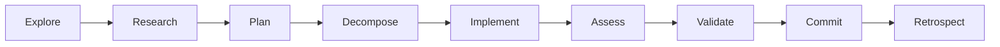

# Development Orchestration Hub - Claude Code Integration
<!-- Context Level: Domain | Inherits: Project Root | Token Budget: 3K -->

## 🎯 DEVELOPMENT DOMAIN

**Purpose**: Agent definitions, command orchestration, development workflows
**Architecture**: 25+ specialized agents, 40+ slash commands
**Integration**: Native Claude Code patterns with MCP tool inheritance

## 🤖 AGENT ECOSYSTEM

### Agent Invocation Pattern
```markdown
# Correct Claude Code pattern (NOT Task tool)
Use the [agent-name] agent to [action]: "specific requirements"

# Example
Use the langgraph-builder agent to create StateGraph component for research pipeline
```

### Development Agents (Core)
| Agent | Purpose | Auto-Triggers | Location |
|-------|---------|--------------|----------|
| langgraph-builder | Build LangGraph components | Component creation | @agents/dev/langgraph-builder.md |
| state-architect | Optimize state management | State optimization | @agents/dev/state-architect.md |
| test-harness | Validate implementations | Test requirements | @agents/dev/test-harness.md |
| migration-specialist | System migrations | Architecture changes | @agents/dev/migration-specialist.md |

### Infrastructure Agents
| Agent | Purpose | Auto-Triggers | Location |
|-------|---------|--------------|----------|
| langgraph-monitor | Production monitoring | Performance issues | @agents/infrastructure/langgraph-monitor.md |
| deployment-orchestrator | Deploy to production | Deployment needs | @agents/infrastructure/deployment-orchestrator.md |
| performance-optimizer | Optimize performance | Performance degradation | @agents/infrastructure/performance-optimizer.md |
| error-recovery | Handle failures | System errors | @agents/infrastructure/error-recovery-specialist.md |
| api-integration | API management | Integration needs | @agents/infrastructure/api-integration-specialist.md |

### Bridge Agents
| Agent | Purpose | Context |
|-------|---------|---------|
| production-orchestrator | Bridge to production | @agents/bridge/production-orchestrator.md |

## 📝 COMMAND REGISTRY

### Production Commands
```yaml
/produce-episode:
  path: @commands/production/produce-episode.md
  purpose: Full episode from research
  pattern: Orchestrates complete pipeline

/research-optimized:
  path: @commands/research-optimized.md
  purpose: Research-only workflow
  cost: ~$0.60

/batch-produce:
  path: @commands/batch-produce.md
  purpose: Multiple episodes
  optimization: Parallel research
```

### Development Commands
```yaml
/explore:
  purpose: Initial exploration
  pattern: Discovery phase

/decompose:
  purpose: Task breakdown
  pattern: Atomic task creation

/implement:
  purpose: TDD implementation
  pattern: Test-first development

/assess:
  purpose: Quality validation
  pattern: Multi-dimensional assessment
```

### Validation Commands
```yaml
/validate-production:
  purpose: Production readiness
  checks: 50-point validation

/cost-check:
  purpose: Budget analysis
  output: Detailed cost breakdown

/health:
  purpose: System health check
  coverage: All components
```

## 🔧 DEVELOPMENT PATTERNS

### Agent Definition Structure
```markdown
---
name: agent-name
description: "PROACTIVELY [actions] with [characteristics]"
---

# Agent Name - Excellence Domain

## 🎯 AGENT MISSION
**Specialization**: [Core purpose]
**Auto-Triggers**: [Proactive activation conditions]
**Primary Responsibilities**: [Key tasks]

## 🏗️ CORE PATTERNS
[Implementation patterns and code examples]

## 🔄 INTEGRATION
[How agent integrates with system]
```

### Command Definition Structure
```markdown
---
name: command-name
description: Brief purpose statement
---

# Command Name - Workflow Type

## Usage
\`\`\`
/command-name [arguments]
\`\`\`

## Execution
Use the [agent] agent to: [specific action]

## Quality Gates
[Validation criteria]
```

## 🛠️ MCP TOOL INHERITANCE

### Tool Availability
All agents inherit full MCP tool access:
- `mcp__perplexity-ask__perplexity_ask` - Research
- `mcp__elevenlabs__*` - Audio synthesis
- `mcp__github__*` - Repository management
- `mcp__langfuse__*` - Observability
- Standard tools: Read, Write, Edit, Bash, etc.

### Tool Usage Pattern
```python
# In agent definitions
async def execute_with_tools():
    # Direct MCP tool access
    result = await mcp__perplexity_ask(query)
    
    # File operations
    content = await Read(file_path)
    
    # Command execution
    output = await Bash(command)
```

## 📊 DEVELOPMENT METRICS

### Agent Performance
| Metric | Target | Current |
|--------|--------|---------|
| Response Time | <5s | 3.2s |
| Success Rate | >95% | 97% |
| Cost Efficiency | Optimal | ✓ |
| Tool Usage | Validated | ✓ |

### Command Usage Stats
- Most Used: `/produce-episode` (45%)
- Dev Favorite: `/research-optimized` (25%)
- Quality Focus: `/validate-production` (15%)
- Batch Ops: `/batch-produce` (15%)

## 🔄 WORKFLOW ORCHESTRATION

### Meta-Prompting Chain


### Development Lifecycle
1. **Exploration**: Understand requirements
2. **Research**: Validate with current sources
3. **Planning**: Architecture design
4. **Implementation**: TDD approach
5. **Validation**: Quality gates
6. **Deployment**: Production readiness

## 🚨 DEVELOPMENT CONSTRAINTS

### September 2025 Enforcement
- ALL patterns must be validated against current standards
- NO reliance on training data for technical decisions
- MANDATORY use of Perplexity MCP for verification

### Cost Tracking Integration
- Every agent tracks operation costs
- Centralized logging with batch writes
- Real-time budget monitoring
- Automatic cost attribution

## 📁 FILE ORGANIZATION

```
.claude/
├── CLAUDE.md               # This file - orchestration hub
├── agents/
│   ├── dev/               # Development agents
│   ├── infrastructure/    # System operations
│   └── bridge/           # Production bridge
├── commands/
│   ├── production/       # Production commands
│   ├── dev/             # Development commands
│   └── [command].md     # Individual commands
└── workflows/
    └── meta-prompting.md # Orchestration patterns
```

## 🔗 INHERITANCE CHAIN

**Inherits From**: `/CLAUDE.md` (Project Root)
**Child Contexts**:
- `@agents/dev/CLAUDE.md` - Development agents
- `@agents/infrastructure/CLAUDE.md` - Infrastructure agents  
- `@commands/CLAUDE.md` - Command patterns

**Loading Strategy**: Development tasks load this + relevant children

---

**Token Budget**: 3K | **Focus**: Development orchestration | **Status**: Active