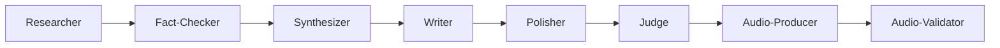

# 🤖 Agent Orchestration Domain
<!-- Domain Context | Token Budget: 4K | Purpose: Agent Patterns & Coordination -->

## 🎯 AGENT SYSTEM OVERVIEW

**Architecture:** 10 specialized agents using Claude Code native patterns  
**Invocation:** Direct sub-agent calls (NOT Task tool)  
**MCP Inheritance:** All agents inherit MCP tools automatically  
**Coordination:** Sequential and parallel execution patterns

## 📋 AGENT ROSTER

### Research Team (Zero Training Data)
```yaml
researcher:
  purpose: "Complete research solution"
  mcp_tool: "mcp__perplexity-ask__perplexity_ask"
  capabilities:
    - Topic landscape mapping
    - Expert discovery (2024-2025)
    - Multi-query investigation
    - Knowledge synthesis
  output: "research_package.json"

fact-checker:
  purpose: "Verification and validation"
  tools: ["WebSearch", "mcp__perplexity-ask"]
  capabilities:
    - Source triangulation
    - Date verification
    - Statistical validation
    - Contradiction detection
  output: "validation_report.json"

synthesizer:
  purpose: "Knowledge packaging"
  capabilities:
    - Research integration
    - Narrative coherence
    - Production preparation
    - Cross-episode intelligence
  output: "synthesis_package.json"
```

### Production Team
```yaml
writer:
  purpose: "Episode script creation"
  input: "synthesis_package.json"
  capabilities:
    - 28-minute script structure
    - Three-part explanations
    - Intellectual humility integration
    - Brand voice consistency
  output: "initial_script.md"

polisher:
  purpose: "TTS optimization"
  capabilities:
    - SSML markup insertion
    - Pronunciation guides
    - Pacing optimization
    - Amelia voice tuning
  output: "polished_script.md"

judge:
  purpose: "Quality consensus"
  evaluators:
    claude: "55% weight - brand/creativity"
    gemini: "45% weight - technical/structure"
    perplexity: "fact verification"
  threshold: "≥85% consensus"
  output: "quality_report.json"
```

### Audio Team
```yaml
audio-producer:
  purpose: "Voice synthesis"
  mcp_tool: "mcp__elevenlabs__text_to_speech"
  config:
    voice_id: "ZF6FPAbjXT4488VcRRnw"
    model: "eleven_turbo_v2_5"
    stability: 0.65
    similarity_boost: 0.8
  output: "episode_audio.mp3"

audio-validator:
  purpose: "Quality verification"
  mcp_tool: "mcp__elevenlabs__speech_to_text"
  thresholds:
    word_accuracy: "≥90%"
    audio_quality: "≥85%"
  output: "validation_results.json"
```

### Support Team
```yaml
batch-processor:
  purpose: "Multi-episode coordination"
  capabilities:
    - Parallel episode processing
    - Resource optimization
    - Queue management
    - Progress tracking
  
cost-monitor:
  purpose: "Budget tracking"
  capabilities:
    - Real-time cost attribution
    - Phase-based allocation
    - Budget enforcement
    - Overage alerts
```

## 🎭 INVOCATION PATTERNS

### Correct Pattern (Native Claude Code)
```markdown
Use the researcher agent to investigate "topic": "Requirements..."
```

### INCORRECT Pattern (Don't Use)
```markdown
❌ Use Task tool to delegate to researcher
❌ Manually specify tools in agent YAML
❌ Create custom agent proxies
```

### Sequential Orchestration
```yaml
workflow: research → script → audio
pattern: |
  1. Use researcher agent for investigation
  2. Pass output to writer agent
  3. Use polisher agent for optimization
  4. Use judge agent for consensus
  5. Use audio-producer for synthesis
  6. Use audio-validator for quality check
```

### Parallel Execution
```yaml
concurrent_research:
  - Use researcher for main investigation
  - Use fact-checker for verification
  - Merge results with synthesizer

concurrent_validation:
  - Use judge for quality consensus
  - Use cost-monitor for budget tracking
  - Aggregate results for decision
```

## 🔄 AGENT COMMUNICATION

### Data Flow


### Output Schemas
```json
// Standard agent output
{
  "agent": "agent-name",
  "status": "success|failure",
  "output": {
    // Agent-specific data
  },
  "metrics": {
    "execution_time": 45.2,
    "tokens_used": 3500,
    "cost": 0.35
  },
  "errors": []
}
```

## 🛡️ ERROR HANDLING

### Retry Strategy
```yaml
agent_failure:
  max_retries: 3
  backoff: "exponential"
  fallback: "alternative_agent"

mcp_failure:
  retry_with: "different_query"
  fallback_to: "WebSearch"
  log_error: true
```

### Recovery Procedures
1. **Research Failure:** Expand search parameters
2. **Script Failure:** Reduce complexity, retry
3. **Audio Failure:** Chunk text, process segments
4. **Validation Failure:** Lower thresholds, document

## 📊 PERFORMANCE METRICS

### Agent Efficiency
```yaml
researcher:
  avg_time: "3-5 minutes"
  cost: "$0.80-1.20"
  success_rate: "95%"

writer:
  avg_time: "2-3 minutes"
  cost: "$0.40-0.60"
  success_rate: "92%"

audio-producer:
  avg_time: "5-7 minutes"
  cost: "$2.50-3.00"
  success_rate: "98%"
```

### Quality Metrics
```yaml
research_depth: "≥9.0/10"
script_quality: "≥85% consensus"
audio_accuracy: "≥90% STT validation"
brand_consistency: "≥90% alignment"
```

## 🔧 AGENT MANAGEMENT

### Adding New Agents
```bash
# Create agent definition
vim .claude/agents/new-agent.md

# Follow template structure
---
name: agent-name
description: "Purpose statement"
---
# Agent content...
```

### Testing Agents
```bash
# Individual agent test
Use the [agent-name] agent to [test task]

# Integration test
/test-agent-workflow [agent-name]
```

### Monitoring Agents
```bash
# Check agent logs
tail -f .claude/logs/agents/[agent-name].log

# View metrics
cat .claude/metrics/agent-performance.json
```

## 🚀 BEST PRACTICES

### DO's
✅ Use direct agent invocation  
✅ Let agents inherit MCP tools  
✅ Chain outputs between agents  
✅ Monitor cost per agent  
✅ Validate outputs at each step  

### DON'Ts
❌ Use Task tool for delegation  
❌ Specify tools in agent YAML  
❌ Create circular dependencies  
❌ Skip error handling  
❌ Ignore quality gates  

## 🔗 CROSS-REFERENCES

### Related Contexts
- **Commands:** @.claude/commands/CLAUDE.md
- **Configuration:** @.claude/CLAUDE.md
- **Production:** @nobody-knows/CLAUDE.md

### Agent Files
- Research: `.claude/agents/researcher.md`
- Writing: `.claude/agents/writer.md`
- Audio: `.claude/agents/audio-producer.md`
- Validation: `.claude/agents/judge.md`

### Integration Points
- MCP Tools: Automatic inheritance
- State Management: Via production domain
- Cost Tracking: Through hooks system
- Quality Gates: Enforced by judge agent

---

*Agent Orchestration Domain v1.0 | Token Usage: ~3.9K*  
*Central patterns for multi-agent coordination and execution*