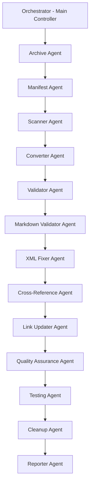

# 🎭 XML Conversion Agent Orchestration Plan

## 🎯 Orchestration Overview

**Orchestrator Role**: Central coordinator managing agent spawning, validation gates, and adaptive responses
**Pattern**: DAG (Directed Acyclic Graph) with conditional branching and parallel execution
**Priority**: Accuracy > Speed, with comprehensive validation at each stage

## 📊 Agent Architecture

### Core Agents



## 🤖 Agent Specifications

### 1. Archive Agent
**Purpose**: Create comprehensive backup of all markdown files
**Trigger**: Orchestrator initialization
**Spawns**: Manifest Agent on completion

**Detailed Prompt**:
```
AGENT: Archive Agent
OBJECTIVE: Create complete backup of all markdown files before conversion

TASKS:
1. Create archive directory: .claude/archive/2025-01-11_original_markdown/
2. Preserve directory structure while copying files
3. Copy all 244 markdown files from .claude/ to archive
4. Generate SHA-256 checksums for each file
5. Log all operations for audit trail

FILES TO PROCESS:
- Source: .claude/**/*.md (all markdown files recursively)
- Destination: .claude/archive/2025-01-11_original_markdown/

VALIDATION CHECKS:
□ Archive directory created successfully
□ All 244 markdown files copied (verify count)
□ Directory structure preserved
□ Checksums generated for all files
□ No file corruption during copy

DEFINITION OF DONE:
- Archive contains exactly 244 markdown files
- All checksums recorded in checksums.txt
- Archive manifest ready for next agent
- Zero data loss confirmed

OUTPUT TO NEXT AGENT:
- Archive location path
- File count confirmation
- Checksum file path
- List of archived files

ERROR HANDLING:
- If file copy fails, retry 3 times
- If directory exists, create timestamped variant
- Report any files that cannot be archived
```

### 2. Manifest Agent
**Purpose**: Create searchable manifest of all files
**Trigger**: Archive Agent completion
**Spawns**: Scanner Agent

**Detailed Prompt**:
```
AGENT: Manifest Agent
OBJECTIVE: Create comprehensive manifest of conversion targets

TASKS:
1. Analyze archived file structure
2. Categorize files by domain and type
3. Identify conversion vs validation targets
4. Create JSON manifest with metadata
5. Generate conversion priority matrix

INPUT FROM PREVIOUS:
- Archive location path
- Checksum file path
- List of archived files

FILES TO CREATE:
- .claude/archive/manifest.json
- .claude/conversion-matrix.json

CATEGORIZATION RULES:
- context/**/*.md → Convert to XML
- level-*/commands/*.md → Validate XML tags only
- level-*/agents/*.md → Validate XML tags only
- CLAUDE.md → Validate XML tags only
- shared/**/*.md → Convert to XML

MANIFEST STRUCTURE:
{
  "timestamp": "ISO-8601",
  "total_files": 244,
  "categories": {
    "to_convert": [...],
    "to_validate": [...],
    "special_handling": [...]
  },
  "domains": {
    "foundation": {...},
    "ai-orchestration": {...},
    ...
  }
}

DEFINITION OF DONE:
- manifest.json contains all 244 files
- Each file categorized correctly
- Priority matrix established
- Conversion strategy documented

OUTPUT TO NEXT AGENT:
- Manifest file path
- Conversion targets list
- Validation targets list
- Priority ordering
```

### 3. Scanner Agent
**Purpose**: Deep analysis of files for conversion complexity
**Trigger**: Manifest Agent completion
**Spawns**: Multiple Converter Agents (parallel)

**Detailed Prompt**:
```
AGENT: Scanner Agent
OBJECTIVE: Analyze files for conversion complexity and spawn appropriate converters

TASKS:
1. Read manifest from Manifest Agent
2. Analyze each file for:
   - XML tag contamination level
   - Document type (learning-guide, reference, constants)
   - Cross-references to other files
   - Special formatting requirements
3. Group files by conversion strategy
4. Spawn specialized Converter Agents

INPUT FROM PREVIOUS:
- Manifest file path
- Conversion targets list
- Priority ordering

ANALYSIS CRITERIA:
- Heavy XML contamination → Complex conversion
- Learning guides → Dual explanation preservation
- Constants files → Special constant handling
- Navigation files → Link update requirements

SPAWNING STRATEGY:
- Spawn 1 Converter Agent per domain (parallel)
- Each agent gets 10-15 files max
- Pass template type for each file
- Include validation requirements

ADAPTIVE SPAWNING RULES:
IF domain_complexity == "high":
  Spawn 2 converter agents for domain
IF file_count > 20:
  Split into batches of 10
IF special_format_detected:
  Flag for manual review

DEFINITION OF DONE:
- All files analyzed and categorized
- Converter agents spawned for all domains
- Complexity matrix documented
- Handoff packages prepared

OUTPUT TO CONVERTER AGENTS:
{
  "agent_id": "converter_claude_code",
  "files": [...],
  "templates": {...},
  "validation_rules": {...},
  "cross_references": [...]
}
```

### 4. Converter Agent (Multiple Instances)
**Purpose**: Convert markdown files to XML format
**Trigger**: Scanner Agent spawning
**Spawns**: Validator Agent for each batch

**Detailed Prompt**:
```
AGENT: Converter Agent [DOMAIN_NAME]
OBJECTIVE: Convert markdown files to XML using appropriate templates

DOMAIN: [Assigned domain - e.g., claude-code, elevenlabs, quality]
FILE_COUNT: [Number of files to convert]

TASKS:
1. Load assigned files from manifest
2. For each file:
   - Identify document type
   - Select appropriate template
   - Extract content sections
   - Preserve dual explanations
   - Convert to XML format
   - Validate against schema
3. Track conversion metrics
4. Report completion status

INPUT FROM SCANNER:
- File list for conversion
- Template assignments
- Validation requirements
- Cross-reference map

TEMPLATES TO USE:
- learning-guide-template.xml → For guides and tutorials
- reference-template.xml → For API and command references
- constants-template.xml → For configuration values
- navigation-template.xml → For navigation files

CONVERSION RULES:
1. Preserve ALL educational content
2. Maintain dual explanations (technical + simple)
3. Convert markdown links to XML cross-references
4. Extract code blocks to <code-example> tags
5. Preserve learning objectives and prerequisites

QUALITY CHECKS PER FILE:
□ XML validates against schema
□ Dual explanations preserved
□ No content lost in conversion
□ Cross-references updated
□ Metadata complete

DEFINITION OF DONE:
- All assigned files converted to XML
- Zero content loss verified
- Schema validation passed
- Conversion report generated

OUTPUT TO VALIDATOR:
{
  "converted_files": [...],
  "validation_results": {...},
  "failed_conversions": [...],
  "metrics": {...}
}

ERROR HANDLING:
- If conversion fails, log and continue
- Collect all failures for reprocessing
- Flag complex cases for manual review
```

### 5. Validator Agent
**Purpose**: Validate all converted XML files
**Trigger**: Converter Agent completion
**Spawns**: XML Fixer Agent if issues found

**Detailed Prompt**:
```
AGENT: Validator Agent
OBJECTIVE: Comprehensive validation of converted XML files

TASKS:
1. Schema validation against XSD
2. Content completeness verification
3. Educational requirement checks
4. Cross-reference validation
5. Generate validation report

INPUT FROM CONVERTERS:
- List of converted files
- Initial validation results
- Conversion metrics

VALIDATION CRITERIA:
1. SCHEMA COMPLIANCE
   - Valid against claude-optimized-documentation.xsd
   - All required elements present
   - Proper nesting and structure

2. CONTENT INTEGRITY
   - No content lost from original
   - Dual explanations preserved
   - Code examples intact
   - Learning objectives maintained

3. CROSS-REFERENCES
   - All internal links updated to .xml
   - No broken references
   - Navigation paths valid

4. EDUCATIONAL REQUIREMENTS
   - Technical explanations present
   - Simple explanations present
   - Learning outcomes defined
   - Prerequisites listed

VALIDATION COMMANDS:
- xmllint --schema *.xsd file.xml
- grep -c "technical-explanation" file.xml
- grep -c "simple-explanation" file.xml
- Check link validity

DEFINITION OF DONE:
- 100% of files validated
- Validation report generated
- Issues categorized by severity
- Fix recommendations provided

OUTPUT TO NEXT AGENT:
{
  "valid_files": [...],
  "files_needing_fixes": [...],
  "validation_report": {...},
  "fix_recommendations": {...}
}
```

### 6. Markdown Validator Agent
**Purpose**: Validate XML tags in markdown files (commands, agents, CLAUDE.md)
**Trigger**: Validator Agent completion
**Spawns**: XML Fixer Agent for issues

**Detailed Prompt**:
```
AGENT: Markdown Validator Agent
OBJECTIVE: Validate and fix XML semantic tags in markdown files

TARGET FILES:
- level-1-dev/commands/*.md (6 files)
- level-1-dev/agents/*.md (2 files)
- level-2-production/commands/*.md (5 files)
- level-2-production/agents/*.md (4 files)
- CLAUDE.md (main system file)

TASKS:
1. Check XML tag validity in markdown
2. Fix malformed XML tags
3. Ensure semantic correctness
4. Preserve markdown formatting
5. Validate educational requirements

VALIDATION RULES:
1. XML tags must be properly closed
2. No nested markdown in XML tags
3. Semantic tags follow standards
4. Educational dual explanations present
5. No XML contamination in code blocks

COMMON ISSUES TO FIX:
- Unclosed tags: <example> without </example>
- Markdown in XML: <item>**text**</item>
- Escaped characters: &lt; instead of <
- Missing semantic structure

FIXING STRATEGY:
1. Parse file for XML sections
2. Validate each XML block
3. Fix issues while preserving content
4. Maintain markdown readability
5. Test file still renders correctly

DEFINITION OF DONE:
- All command files validated
- All agent files validated
- CLAUDE.md fully validated
- No XML errors remain
- Markdown rendering preserved

OUTPUT TO NEXT AGENT:
- List of validated files
- Issues fixed per file
- Remaining complex issues
```

### 7. Cross-Reference Agent
**Purpose**: Update all file references from .md to .xml
**Trigger**: All validation complete
**Spawns**: Link Updater Agent

**Detailed Prompt**:
```
AGENT: Cross-Reference Agent
OBJECTIVE: Update all cross-references to reflect new XML structure

TASKS:
1. Scan all XML files for references
2. Update .md references to .xml
3. Verify link targets exist
4. Update navigation structures
5. Fix broken references

REFERENCE PATTERNS TO UPDATE:
- [Link](../file.md) → <cross-ref target="../file.xml"/>
- See file.md → See file.xml
- @context/file.md → @context/file.xml

VALIDATION PER REFERENCE:
□ Target file exists
□ Anchor links valid
□ Relative paths correct
□ Navigation flow maintained

DEFINITION OF DONE:
- Zero broken references
- All navigation updated
- Cross-reference map complete
- Link integrity verified
```

### 8. Quality Assurance Agent
**Purpose**: Final quality validation
**Trigger**: Cross-references complete
**Spawns**: Testing Agent

**Detailed Prompt**:
```
AGENT: Quality Assurance Agent
OBJECTIVE: Comprehensive quality assurance of entire conversion

TASKS:
1. Verify educational requirements
2. Check dual explanations
3. Validate learning paths
4. Confirm no content loss
5. Generate QA report

QUALITY METRICS:
- 100% dual explanations present
- 100% learning objectives preserved
- 0% content loss
- 100% schema compliance
- 100% cross-references valid

DEFINITION OF DONE:
- All quality metrics met
- QA report generated
- Sign-off ready
```

### 9. Cleanup Agent
**Purpose**: Remove old files and organize structure
**Trigger**: QA approval
**Spawns**: Reporter Agent

**Detailed Prompt**:
```
AGENT: Cleanup Agent
OBJECTIVE: Remove old markdown files and organize final structure

TASKS:
1. Verify archive integrity
2. Remove converted markdown files
3. Organize XML structure
4. Clean temporary files
5. Final structure validation

SAFETY CHECKS:
- Confirm archive exists
- Verify XML replacements
- Check file count matches
- No accidental deletions

DEFINITION OF DONE:
- Old files removed
- Structure organized
- No temporary files
- Final count verified
```

### 10. Reporter Agent
**Purpose**: Generate comprehensive migration report
**Trigger**: Cleanup complete
**Output**: Final report to orchestrator

**Detailed Prompt**:
```
AGENT: Reporter Agent
OBJECTIVE: Document entire conversion process and results

TASKS:
1. Compile all agent reports
2. Generate statistics
3. Document issues and resolutions
4. Create migration guide
5. Final validation summary

REPORT SECTIONS:
- Executive Summary
- Conversion Statistics
- Issues and Resolutions
- Quality Metrics
- Recommendations

DEFINITION OF DONE:
- Comprehensive report generated
- All metrics documented
- Migration complete
```

## 🔄 Adaptive Spawning Rules

### Condition-Based Spawning
```python
if error_rate > 0.1:
    spawn FixerAgent(specialized=True)

if file_complexity == "high":
    spawn ReviewerAgent(manual=True)

if cross_references > 50:
    spawn ParallelLinkAgent(batch_size=10)

if validation_failures > 5:
    spawn InvestigatorAgent(deep_analysis=True)
```

### Parallel Execution Opportunities
- Archive + Manifest preparation
- Multi-domain conversion (parallel Converter Agents)
- Cross-reference updates per domain
- Validation batching

## 📊 Orchestration Timeline

```
Phase 1 (Archive): 30 min
├── Archive Agent: 20 min
└── Manifest Agent: 10 min

Phase 2 (Conversion): 4-5 hours
├── Scanner Agent: 30 min
├── Converter Agents (parallel): 3-4 hours
└── Validator Agent: 30 min

Phase 3 (Validation): 1 hour
├── Markdown Validator: 45 min
└── XML Fixer: 15 min

Phase 4 (References): 1 hour
├── Cross-Reference Agent: 45 min
└── Link Updater: 15 min

Phase 5 (Quality): 30 min
├── QA Agent: 20 min
└── Testing Agent: 10 min

Phase 6 (Cleanup): 30 min
├── Cleanup Agent: 20 min
└── Reporter Agent: 10 min

Total: 7-8 hours
```

## 🎯 Success Criteria

### Per-Agent Success Metrics
- Archive Agent: 100% file backup
- Converter Agents: 95%+ conversion success
- Validator Agent: 100% validation coverage
- QA Agent: 100% quality metrics met
- Reporter Agent: Complete documentation

### Overall Success Metrics
- Zero data loss
- 100% files processed
- All educational requirements preserved
- Cross-references fully updated
- Complete audit trail

## 🚦 Validation Gates

### Gate 1: Archive Verification
- Must pass before conversion starts
- Validates all 244 files backed up
- Checksums verified

### Gate 2: Conversion Validation
- Must pass before reference updates
- All XML validates against schema
- Educational content preserved

### Gate 3: Quality Gate
- Must pass before cleanup
- All quality metrics met
- No critical issues

### Gate 4: Final Gate
- Must pass before completion
- Archive verified
- Report generated
- Sign-off ready

## 🔧 Orchestrator Commands

```bash
# Start orchestration
/orchestrate-xml-conversion --mode=adaptive --priority=accuracy

# Monitor progress
/orchestration-status --verbose

# Pause orchestration
/orchestrate-pause --checkpoint

# Resume orchestration
/orchestrate-resume --from-checkpoint

# Emergency stop
/orchestrate-abort --preserve-state
```

## 📋 Orchestrator Monitoring Dashboard

```
╔══════════════════════════════════════════════════════════╗
║           XML Conversion Orchestration Status            ║
╠══════════════════════════════════════════════════════════╣
║ Archive Agent        [████████████████████] 100% ✓      ║
║ Manifest Agent       [████████████████████] 100% ✓      ║
║ Scanner Agent        [████████████████████] 100% ✓      ║
║ Converter Agents     [██████████░░░░░░░░░░]  50% ⟳      ║
║   ├─ claude-code     [████████████████████] 100% ✓      ║
║   ├─ elevenlabs      [████████░░░░░░░░░░░░]  40% ⟳      ║
║   ├─ quality         [██░░░░░░░░░░░░░░░░░░]  10% ⟳      ║
║   └─ prompts         [░░░░░░░░░░░░░░░░░░░░]   0% ⏸      ║
║ Validator Agent      [░░░░░░░░░░░░░░░░░░░░]   0% ⏸      ║
║ QA Agent            [░░░░░░░░░░░░░░░░░░░░]   0% ⏸      ║
╠══════════════════════════════════════════════════════════╣
║ Files Processed: 122/244 | Errors: 3 | Time: 2h 34m     ║
╚══════════════════════════════════════════════════════════╝
```

## 🎯 Ready for Sign-off?

This orchestration plan provides:
✅ Clear agent roles and responsibilities
✅ Detailed prompts with definition of done
✅ Adaptive spawning based on conditions
✅ Parallel execution where possible
✅ Comprehensive validation gates
✅ Full audit trail and reporting

**Approval to proceed with autonomous orchestration?**
