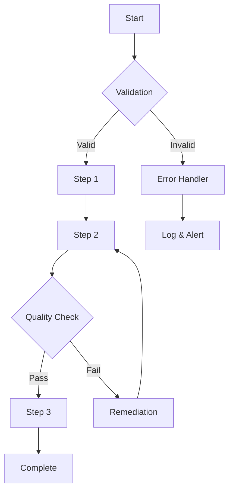

<document type="workflow" version="3.1.0" enhanced="2025-08-11">
  <metadata>
    <title>[Workflow Name]</title>
    <category>[development|production|quality|operations]</category>
    <complexity>[simple|moderate|complex]</complexity>
    <duration>[estimated-time]</duration>
    <frequency>[daily|weekly|per-episode|as-needed]</frequency>
    <navigation>
      <prev>@[previous-workflow].md</prev>
      <index>@workflows/README.md</index>
      <next>@[next-workflow].md</next>
    </navigation>
  </metadata>

  

    [2-3 sentence overview of what this workflow accomplishes and when it's used]
  

</document>

# [Workflow Name] Workflow

## Overview

<purpose>
  <objective>[Primary goal of this workflow]</objective>
  <triggers>
    - [Event or condition that starts this workflow]
    - [Alternative trigger]
  </triggers>
  <outcomes>
    - [Expected result 1]
    - [Expected result 2]
  </outcomes>
</purpose>

## Prerequisites

<prerequisites>
  <environment>
    - [ ] [Required setup or configuration]
    - [ ] [Required tools or access]
    - [ ] [Required knowledge or skills]
  </environment>

  <dependencies>
    - [ ] @[required-file].md exists
    - [ ] @[required-command].md available
    - [ ] [External service] configured
  </dependencies>

  <inputs>
    - [Input 1]: [Format and source]
    - [Input 2]: [Format and source]
  </inputs>
</prerequisites>

## Workflow Diagram

## Detailed Steps

<workflow-steps>
  <phase name="Initialization">
    <step number="1">
      <action>Validate Prerequisites</action>
      <command>`/validate-environment`</command>
      <verification>All checks return green</verification>
      <on-failure>Stop and address missing requirements</on-failure>
    </step>

    <step number="2">
      <action>Load Configuration</action>
      <command>`/load-config [workflow-name]`</command>
      <verification>Config loaded successfully</verification>
      <on-failure>Check config file exists and is valid</on-failure>
    </step>
  </phase>

  <phase name="Main Processing">
    <step number="3">
      <action>[Primary processing action]</action>
      <command>`/[main-command] [arguments]`</command>
      <duration>[X-Y minutes]</duration>
      <verification>[How to verify success]</verification>
      <on-failure>[Recovery procedure]</on-failure>
    </step>

    <step number="4">
      <action>[Secondary processing action]</action>
      <command>`/[secondary-command] [arguments]`</command>
      <duration>[X-Y minutes]</duration>
      <verification>[How to verify success]</verification>
      <on-failure>[Recovery procedure]</on-failure>
    </step>
  </phase>

  <phase name="Quality Assurance">
    <step number="5">
      <action>Run Quality Checks</action>
      <command>`/quality-check [output]`</command>
      <thresholds>
        - [Metric 1] ≥ [threshold]
        - [Metric 2] ≥ [threshold]
      </thresholds>
      <on-failure>Return to Step 3 with adjustments</on-failure>
    </step>
  </phase>

  <phase name="Finalization">
    <step number="6">
      <action>Generate Output</action>
      <command>`/generate-output [format]`</command>
      <location>[Where output is saved]</location>
      <verification>Output file exists and is valid</verification>
    </step>

    <step number="7">
      <action>Update Tracking</action>
      <command>`/update-session [workflow-id]`</command>
      <metrics>Record time, cost, quality scores</metrics>
    </step>
  </phase>
</workflow-steps>

## Decision Points

<decisions>
  <decision point="Quality Gate">
    <condition>Quality score < threshold</condition>
    <options>
      <option choice="Retry">
        <action>Adjust parameters and reprocess</action>
        <max-retries>3</max-retries>
      </option>
      <option choice="Escalate">
        <action>Alert human for manual review</action>
        <notification>Send to Slack/email</notification>
      </option>
      <option choice="Accept">
        <action>Document known issues and proceed</action>
        <requirement>Explicit approval required</requirement>
      </option>
    </options>
  </decision>
</decisions>

## Automation Opportunities

<automation>
  <current-manual>
    - [Step that could be automated]
    - [Another manual step]
  </current-manual>

  <hooks-available>
    <hook trigger="pre-execution">
      <action>Validate all inputs</action>
      
    </hook>

    <hook trigger="post-execution">
      <action>Archive outputs</action>
      
    </hook>
  </hooks-available>

  <future-automation>
    - [Planned automation 1]
    - [Planned automation 2]
  </future-automation>
</automation>

## Monitoring & Metrics

<monitoring>
  <key-metrics>
    <metric name="Duration">
      <target>[X minutes]</target>
      <alert-threshold>[Y minutes]</alert-threshold>
    </metric>

    <metric name="Success Rate">
      <target>[95%]</target>
      <calculation>[successful runs / total runs]</calculation>
    </metric>

    <metric name="Cost">
      <target>[$X.XX]</target>
      <components>[API calls + compute + storage]</components>
    </metric>
  </key-metrics>

  <logging>
    <location>`.claude/[level]/sessions/[workflow-name]/`</location>
    <retention>[30 days]</retention>
    <format>JSON with timestamps and metrics</format>
  </logging>
</monitoring>

## Troubleshooting Guide

<troubleshooting>
  <common-issues>
    <issue symptom="Workflow hangs at Step 3">
      <diagnosis>Check API connectivity</diagnosis>
      <solution>
        1. Test API endpoint: `curl [endpoint]`
        2. Verify API keys are valid
        3. Check rate limits
      </solution>
    </issue>

    <issue symptom="Quality checks consistently fail">
      <diagnosis>Parameters may need adjustment</diagnosis>
      <solution>
        1. Review recent quality scores
        2. Adjust thresholds in config
        3. Consider model upgrade
      </solution>
    </issue>
  </common-issues>

  <debugging-tools>
    - Verbose mode: Add `--verbose` flag
    - Dry run: Add `--dry-run` flag
    - Step mode: Add `--step` flag for manual progression
  </debugging-tools>
</troubleshooting>

## Best Practices

<best-practices>
  <do>
    - ✅ Always validate inputs before processing
    - ✅ Save intermediate outputs for debugging
    - ✅ Log all decisions and quality scores
    - ✅ Test with small samples first
  </do>

  <dont>
    - ❌ Skip quality checks to save time
    - ❌ Ignore warning messages
    - ❌ Process without checking prerequisites
    - ❌ Modify workflow without testing
  </dont>

  <tips>
    - 💡 Run in dry-run mode for new configurations
    - 💡 Keep backup of last known good configuration
    - 💡 Document any manual interventions
  </tips>
</best-practices>

## Related Resources

<related>
  <workflows>
    - @[related-workflow-1].md - [Relationship]
    - @[related-workflow-2].md - [Relationship]
  </workflows>

  <commands>
    - @[command-1].md - Used in Step 3
    - @[command-2].md - Used in Step 4
  </commands>

  <documentation>
    - @[quality-standards].md - Quality thresholds
    - @[troubleshooting-guide].md - Extended debugging
  </documentation>
</related>

---

<validation>
  <last-tested>2025-08-11</last-tested>
  <success-rate>95%</success-rate>
  <average-duration>X minutes</average-duration>
  <next-review>2025-09-11</next-review>
</validation>
