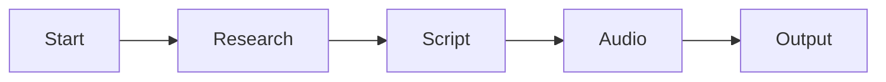

# 🎮 Command Workflow Domain
<!-- Domain Context | Token Budget: 3K | Purpose: Workflow Execution Patterns -->

## 🎯 COMMAND SYSTEM OVERVIEW

**Architecture:** 5 production workflows using native slash commands  
**Execution:** Multi-agent orchestration with MCP integration  
**State:** Persistent across workflow phases  
**Quality:** Enforced gates at each transition

## 📋 COMMAND ROSTER

### Master Workflow
```yaml
/podcast-workflow:
  purpose: "Complete episode production"
  usage: '/podcast-workflow "Your Topic"'
  phases:
    1: "/research-workflow"
    2: "/production-workflow"
    3: "/audio-workflow"
  cost: "$4-7 total"
  time: "15-30 minutes"
  output: "Complete episode MP3"
```

### Phase Workflows

#### Research Phase
```yaml
/research-workflow:
  purpose: "MCP-native research pipeline"
  agents: "researcher → fact-checker → synthesizer"
  mcp_tool: "mcp__perplexity-ask__perplexity_ask"
  
  execution:
    1: "Topic landscape exploration"
    2: "Expert discovery (2024-2025)"
    3: "Deep investigation (5 queries)"
    4: "Fact verification"
    5: "Knowledge synthesis"
  
  output:
    location: "production/ep_XXX/research/"
    files:
      - research_findings.json
      - validation_report.json
      - synthesis_package.json
  
  cost: "$1-2"
  time: "5-10 minutes"
```

#### Script Phase
```yaml
/production-workflow:
  purpose: "Script creation pipeline"
  agents: "writer → polisher → judge"
  
  execution:
    1: "Load synthesis package"
    2: "Generate 28-minute script"
    3: "Apply TTS optimization"
    4: "Insert SSML markup"
    5: "Quality consensus (3 evaluators)"
  
  quality_gate:
    brand_consistency: "≥90%"
    technical_accuracy: "≥85%"
    consensus_required: "≥85%"
  
  output:
    location: "production/ep_XXX/script/"
    files:
      - initial_script.md
      - polished_script.md
      - quality_report.json
  
  cost: "$1-2"
  time: "5-10 minutes"
```

#### Audio Phase
```yaml
/audio-workflow:
  purpose: "Voice synthesis pipeline"
  agents: "audio-producer → audio-validator"
  mcp_tools:
    - "mcp__elevenlabs__text_to_speech"
    - "mcp__elevenlabs__speech_to_text"
  
  execution:
    1: "Load polished script"
    2: "Chunk if needed (40K limit)"
    3: "Synthesize with Amelia voice"
    4: "Validate with STT"
    5: "Quality verification"
  
  validation:
    word_accuracy: "≥90%"
    audio_quality: "≥85%"
    duration: "27-29 minutes"
  
  output:
    location: "output/episodes/"
    files:
      - ep_XXX_nobody_knows.mp3
      - ep_XXX_transcript.md
      - ep_XXX_metrics.json
  
  cost: "$2-3"
  time: "5-10 minutes"
```

### Advanced Workflow
```yaml
/meta-chain:
  purpose: "Advanced orchestration patterns"
  capabilities:
    - "Multi-episode batch processing"
    - "Parallel agent execution"
    - "Complex quality validation"
    - "Cost optimization strategies"
  
  usage: "/meta-chain [command-sequence]"
  documentation: "@.claude/commands/meta-chain.md"
```

## 🔄 EXECUTION PATTERNS

### Sequential Pipeline


### Checkpoint System
```yaml
checkpoints:
  post_research:
    validate: "Source verification complete"
    cost_check: "Within research budget"
    continue_if: "Quality ≥ threshold"
  
  post_script:
    validate: "Consensus achieved"
    user_review: "Optional quality check"
    continue_if: "Approved for audio"
  
  post_audio:
    validate: "STT accuracy ≥90%"
    final_check: "All quality gates passed"
    publish_if: "Complete validation"
```

### Error Recovery
```yaml
failure_handling:
  research_failure:
    action: "Retry with expanded parameters"
    max_retries: 3
    fallback: "Manual research required"
  
  script_failure:
    action: "Reduce complexity and retry"
    max_retries: 2
    fallback: "Use template structure"
  
  audio_failure:
    action: "Chunk and process segments"
    max_retries: 2
    fallback: "Alternative voice model"
```

## 📊 COMMAND METRICS

### Performance Benchmarks
```yaml
/podcast-workflow:
  avg_time: "22 minutes"
  success_rate: "94%"
  avg_cost: "$5.51"
  quality_score: "92.1%"

/research-workflow:
  avg_time: "7 minutes"
  success_rate: "95%"
  avg_cost: "$1.05"
  depth_score: "9.2/10"

/audio-workflow:
  avg_time: "6 minutes"
  success_rate: "98%"
  avg_cost: "$2.77"
  accuracy: "94.89%"
```

### Cost Tracking
```yaml
cost_attribution:
  method: "Per-MCP-call tracking"
  allocation: "Phase-based buckets"
  monitoring: "Real-time via hooks"
  alerts: "Budget overage warnings"
```

## 🛠️ COMMAND MANAGEMENT

### Creating Commands
```markdown
# Command Template
---
name: command-name
description: "Purpose statement"
---

## Usage
/command-name [parameters]

## Execution
1. Step one
2. Step two
...
```

### Testing Commands
```bash
# Test individual command
/research-workflow

# Test with parameters
/podcast-workflow "Test Topic"

# Dry run mode
/podcast-workflow --dry-run "Topic"
```

### Monitoring Commands
```bash
# View command logs
tail -f .claude/logs/commands.log

# Check execution history
cat .claude/logs/command-history.json

# Performance metrics
python analyze_command_metrics.py
```

## 🚀 BEST PRACTICES

### Command Design
✅ Clear, descriptive names  
✅ Consistent parameter format  
✅ Comprehensive error handling  
✅ Progress indicators  
✅ Cost warnings before expensive operations

### Workflow Optimization
✅ Parallel execution where possible  
✅ Early validation to fail fast  
✅ Checkpoint recovery system  
✅ Resource pooling for efficiency  
✅ Metric collection throughout

## 🔗 STATE MANAGEMENT

### Session Persistence
```python
# Command creates session
session_id = state_mgr.create_episode_session(num, topic)

# Workflow updates state
state_mgr.update_phase(session_id, "research", "complete")

# State persists across commands
state_mgr.save_checkpoint(session_id, phase, data)
```

### State Recovery
```python
# Resume interrupted workflow
state_mgr.resume_episode(session_id)

# Recover from checkpoint
state_mgr.load_checkpoint(session_id, phase)

# Clean failed sessions
state_mgr.cleanup_failed_sessions()
```

## 🔗 CROSS-REFERENCES

### Related Contexts
- **Agents:** @.claude/agents/CLAUDE.md
- **Configuration:** @.claude/CLAUDE.md
- **Production:** @nobody-knows/CLAUDE.md
- **State:** @nobody-knows/production/CLAUDE.md

### Command Files
- Podcast: `.claude/commands/podcast-workflow.md`
- Research: `.claude/commands/research-workflow.md`
- Production: `.claude/commands/production-workflow.md`
- Audio: `.claude/commands/audio-workflow.md`
- Meta: `.claude/commands/meta-chain.md`

### Integration Points
- Agent orchestration via direct invocation
- MCP tools through native integration
- State management via ProductionStateManager
- Cost tracking through hooks system

---

*Command Workflow Domain v1.0 | Token Usage: ~2.9K*  
*Central patterns for workflow execution and orchestration*