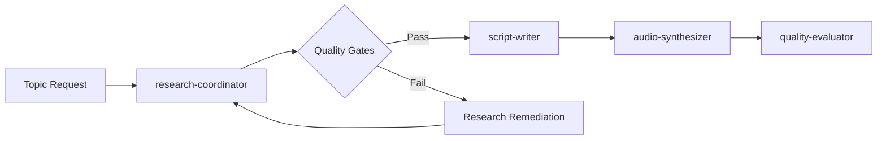

# Research Coordinator - Level 2 Production Integration

## Overview

Integration documentation for the research-coordinator agent within the Level 2 production pipeline, detailing session management, agent coordination, and quality gate enforcement.

## Session Integration

### Session State Management

The research-coordinator integrates with the episode session template at `/Users/smenssink/Documents/GitHub/ai-podcasts-nobody-knows/.claude/level-2-production/sessions/episode-session-template.json`

#### Session State Updates

```json
{
  "production_pipeline": {
    "stages": {
      "research": {
        "status": "in_progress",
        "started_at": "2025-08-11T14:30:00Z",
        "agent": "research-coordinator",
        "attempts": 1,
        "progress": {
          "foundation_layer": "completed",
          "academic_layer": "in_progress", 
          "synthesis": "pending",
          "output_formatting": "pending"
        },
        "quality_gates": {
          "sources_minimum": { "target": 5, "actual": 7, "passed": true },
          "credibility_check": { "target": true, "actual": true, "passed": true },
          "unknown_identified": { "target": true, "actual": true, "passed": true },
          "brand_voice_score": { "target": 0.90, "actual": 0.94, "passed": true }
        },
        "outputs": {
          "research_document": "research_package_dark_matter_20250811.md",
          "source_list": "sources_dark_matter_20250811.json",
          "narrative_angles": "narrative_frameworks_dark_matter_20250811.md"
        },
        "cost": {
          "limit": 3.00,
          "actual": 0.15,
          "breakdown": {
            "web_search": 0.00,
            "web_fetch": 0.15,
            "claude_tokens": 0.00
          }
        }
      }
    }
  }
}
```

### Session Lifecycle Integration

#### 1. Initialization Phase
```bash
# Session manager calls research-coordinator
claude-agent research-coordinator \
  --session-id="ep_027_20250811_1430" \
  --topic="The Mystery of Dark Matter" \
  --complexity="standard" \
  --duration-target=27 \
  --cost-limit=3.00
```

#### 2. Progress Tracking
- Real-time session state updates every 5 minutes
- Quality gate evaluations after each research phase
- Cost tracking with automatic alerts at 80% budget
- Time monitoring with graceful degradation protocols

#### 3. Completion Handoff
```json
{
  "research_completion": {
    "status": "completed",
    "completed_at": "2025-08-11T14:58:00Z",
    "quality_score": 0.92,
    "handoff_package": {
      "research_document": "path/to/research_package.md",
      "confidence_matrix": "path/to/confidence_scores.json", 
      "script_guidance": "path/to/narrative_framework.md",
      "validation_report": "path/to/quality_assessment.json"
    },
    "next_agent": "script-writer",
    "handoff_notes": "Research complete, strong unknown elements identified for Nobody Knows brand. Complex quantum concepts require accessible analogies in script."
  }
}
```

## Agent Coordination Framework

### Production Pipeline Flow



### Inter-Agent Communication

#### Handoff to Script-Writer Agent

**Research Package Structure for Script-Writer Consumption**:

```markdown
# SCRIPT-WRITER HANDOFF: [Topic]

## Research Summary for Script Development
- **Core Narrative**: [1-2 sentence story arc]
- **Target Complexity**: [Accessible/Intermediate] 
- **Key Unknowns**: [Primary "Nobody Knows" elements]
- **Time Allocation Suggestion**: [Intro: 2min, Main: 22min, Conclusion: 3min]

## High-Confidence Content (90%+ verified)
[Facts safe for definitive presentation]

## Medium-Confidence Content (60-89% verified)
[Present with qualifiers like "research suggests"]

## Uncertain/Debated Content (<60% confidence)
[Present multiple perspectives, acknowledge debate]

## Script Development Guidance
### Recommended Analogies
- [Complex Concept A]: Like [Simple Analogy A]
- [Complex Concept B]: Think of it as [Simple Analogy B]

### Key Transitions
- [From setup to mystery]: "But here's where it gets interesting..."
- [From known to unknown]: "This is where our certainty ends..."
- [From problem to frontier]: "And that's exactly what makes this exciting..."

### Intellectual Humility Checkpoints
[Specific places to emphasize uncertainty and ongoing research]

## Production Notes
- **Research Confidence**: [Overall score]
- **Brand Voice Alignment**: [Intellectual humility demonstrated]
- **Accessibility Rating**: [Technical concepts explained]
- **Source Quality**: [Tier breakdown]
```

#### Integration with Audio-Synthesizer Agent

The research-coordinator provides metadata that influences audio production:

```json
{
  "audio_synthesis_guidance": {
    "content_complexity": "moderate",
    "technical_terms": ["dark matter", "WIMPs", "gravitational lensing"],
    "pronunciation_guide": {
      "WIMP": "wimp (like the word)",
      "Zwicky": "TSVICK-ee",
      "Planck": "PLAHNK"
    },
    "emphasis_points": [
      "We can't see it, we can't touch it",
      "Five times more abundant than regular matter",
      "One of physics' greatest mysteries"
    ],
    "pacing_suggestions": {
      "complex_sections": "slower",
      "revelation_moments": "dramatic pause",
      "uncertainty_acknowledgments": "thoughtful tone"
    }
  }
}
```

## Quality Gate Integration

### Automated Quality Gates

#### Gate 1: Source Quality Assessment
```python
def validate_source_quality(research_package):
    """Automated validation of source credibility"""
    
    source_analysis = {
        "tier_1_sources": count_tier_1_sources(research_package),
        "tier_2_sources": count_tier_2_sources(research_package),
        "total_sources": count_total_sources(research_package),
        "credibility_ratio": calculate_credibility_ratio(research_package)
    }
    
    # Quality gates
    gates = {
        "minimum_sources": source_analysis["total_sources"] >= 5,
        "credibility_threshold": source_analysis["credibility_ratio"] >= 0.6,
        "diversity_check": check_source_diversity(research_package)
    }
    
    return all(gates.values()), gates
```

#### Gate 2: Brand Voice Compliance
```python
def validate_brand_voice(research_package):
    """Automated brand voice assessment"""
    
    humility_indicators = [
        "don't know", "uncertain", "mystery", "unknown", 
        "debate", "controversial", "unclear", "research suggests"
    ]
    
    accessibility_indicators = [
        "like", "similar to", "imagine", "think of it as",
        "simply put", "in other words", "for example"
    ]
    
    scores = {
        "intellectual_humility": calculate_humility_score(research_package, humility_indicators),
        "accessibility": calculate_accessibility_score(research_package, accessibility_indicators),
        "curiosity_factor": calculate_curiosity_score(research_package)
    }
    
    # Brand voice requirements
    requirements = {
        "humility_target": scores["intellectual_humility"] >= 0.90,
        "accessibility_target": scores["accessibility"] >= 0.85,
        "curiosity_target": scores["curiosity_factor"] >= 0.80
    }
    
    return all(requirements.values()), scores
```

#### Gate 3: Unknown Identification
```python
def validate_unknown_identification(research_package):
    """Ensure knowledge gaps are properly identified"""
    
    unknown_categories = [
        "knowledge_frontiers",
        "active_debates", 
        "research_gaps",
        "unresolved_questions"
    ]
    
    validation = {
        "has_unknown_section": check_section_exists(research_package, "Knowledge Frontiers"),
        "unknown_specificity": validate_specific_unknowns(research_package),
        "frontier_identification": check_research_frontiers(research_package),
        "debate_acknowledgment": check_debate_sections(research_package)
    }
    
    return all(validation.values()), validation
```

### Quality Gate Failure Recovery

#### Failure Scenarios & Recovery Procedures

**Insufficient Sources (< 5 credible sources)**:
1. Expand search terms and methodologies
2. Include additional free academic databases
3. Accept lower threshold with clear documentation
4. Request topic refinement if sources genuinely unavailable

**Failed Brand Voice Compliance**:
1. Review content for intellectual humility markers
2. Add uncertainty qualifiers where appropriate
3. Simplify technical language using analogies
4. Emphasize knowledge boundaries and ongoing research

**Missing Unknown Identification**:
1. Research current scientific debates in the field
2. Identify specific unanswered questions
3. Highlight methodological limitations
4. Connect to broader epistemological questions

## Cost & Performance Monitoring

### Real-Time Cost Tracking

```python
class ProductionCostMonitor:
    """Monitor costs during research process"""
    
    def __init__(self, session_id, cost_limit=3.00):
        self.session_id = session_id
        self.cost_limit = cost_limit
        self.current_cost = 0.0
        self.cost_breakdown = {
            "web_search": 0.0,
            "web_fetch": 0.0,
            "claude_tokens": 0.0
        }
    
    def track_api_call(self, api_type, cost):
        """Track individual API call costs"""
        self.cost_breakdown[api_type] += cost
        self.current_cost += cost
        
        # Alert at 80% budget
        if self.current_cost >= (self.cost_limit * 0.8):
            self.send_budget_alert()
        
        # Hard stop at 100% budget
        if self.current_cost >= self.cost_limit:
            self.enforce_budget_limit()
    
    def get_remaining_budget(self):
        return max(0, self.cost_limit - self.current_cost)
    
    def optimize_remaining_research(self):
        """Adjust research strategy based on remaining budget"""
        remaining = self.get_remaining_budget()
        
        if remaining < 0.50:
            return "minimal_additional_research"
        elif remaining < 1.00:
            return "targeted_research"
        else:
            return "comprehensive_research"
```

### Performance Metrics Integration

```json
{
  "performance_tracking": {
    "research_efficiency": {
      "time_per_source": "2.3 minutes",
      "verification_rate": "94%",
      "synthesis_speed": "1.2 pages/minute"
    },
    "quality_consistency": {
      "brand_voice_variance": 0.03,
      "source_quality_stability": 0.91,
      "unknown_identification_rate": 0.97
    },
    "production_integration": {
      "handoff_success_rate": 0.98,
      "script_writer_satisfaction": 0.94,
      "revision_requests": 0.12
    }
  }
}
```

## Error Handling & Recovery

### Production Error Categories

#### Category 1: Resource Unavailability
- **WebSearch API limits exceeded**
- **WebFetch timeouts or connection failures**
- **Key sources temporarily unavailable**

**Recovery Strategy**: 
- Fallback to alternative search terms
- Use cached results where available
- Document limitations in research package
- Adjust confidence scores appropriately

#### Category 2: Quality Gate Failures
- **Insufficient source credibility**
- **Brand voice misalignment** 
- **Missing unknown identification**

**Recovery Strategy**:
- Automatic retry with expanded search
- Manual review and remediation
- Graceful degradation with documentation
- Human operator escalation if needed

#### Category 3: Session Integration Failures
- **Session state update failures**
- **Handoff communication errors**
- **Cost tracking inconsistencies**

**Recovery Strategy**:
- Rollback to last known good state
- Manual session state correction
- Alternative communication channels
- Session restart with preserved work

## Continuous Improvement Framework

### Production Learning Integration

```python
class ProductionLearningSystem:
    """Learn from production usage to improve agent performance"""
    
    def collect_feedback(self, session_id, stage, feedback):
        """Collect feedback from downstream agents and human operators"""
        self.feedback_db.insert({
            "session_id": session_id,
            "stage": stage,
            "feedback": feedback,
            "timestamp": datetime.now(),
            "agent_version": self.get_agent_version()
        })
    
    def analyze_patterns(self):
        """Identify improvement opportunities"""
        patterns = {
            "common_failures": self.identify_failure_patterns(),
            "quality_trends": self.analyze_quality_trends(),
            "cost_optimizations": self.find_cost_savings(),
            "time_bottlenecks": self.identify_time_issues()
        }
        return patterns
    
    def update_agent_prompts(self, improvements):
        """Apply learnings to agent configuration"""
        # Update research strategies
        # Refine quality gates
        # Optimize cost management
        # Enhance error handling
        pass
```

### Metrics Dashboard Integration

Key performance indicators tracked in real-time:

- **Research Quality Score**: Rolling 30-day average
- **Cost Efficiency**: Cost per research package over time
- **Time Performance**: Research completion time distribution
- **Brand Voice Consistency**: Intellectual humility scoring trends
- **Production Integration**: Handoff success rates and satisfaction scores

This integration framework ensures the research-coordinator operates seamlessly within the Level 2 production environment while maintaining the high quality standards expected for the "Nobody Knows" podcast brand.