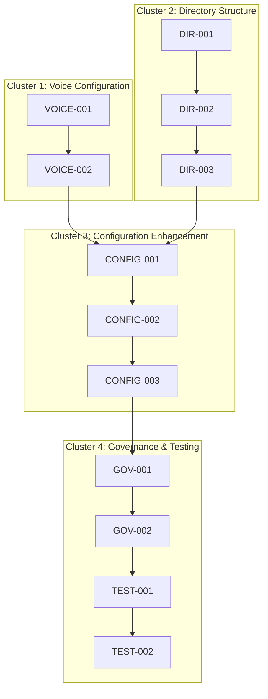

# Task Decomposition: Configuration Management and Hardcoding Resolution
**Project:** AI Podcast Production System Governance Compliance  
**Date:** September 2, 2025  
**Decomposition Confidence:** 9.0/10  
**Total Estimated Duration:** 13 hours

---

## Atomic Task Registry

### Phase 1: Critical Compliance Resolution (6 hours)

#### P1.1 Voice Configuration System Implementation

**Task P1.1.1: Create Centralized VoiceConfig Class**
- **ID:** VOICE-001
- **Duration:** 2 hours
- **Skill:** Python Development + Pydantic
- **Purpose:** Implement type-safe voice configuration with governance controls
- **Inputs:** Research findings on Pydantic Settings patterns, current voice usage analysis
- **Process:** 
  1. Create `src/podcast_production/config/voice_config.py` with Pydantic Settings
  2. Implement VoiceConfig class with production voice ID field
  3. Add validation for approved voice IDs with governance controls
  4. Create environment variable override support
- **Outputs:** Centralized voice configuration system with type safety and validation
- **Acceptance Criteria:**
  - VoiceConfig class loads from environment variables
  - Production voice ID validated against approved list
  - Governance controls prevent unauthorized voice changes
- **Testing:** Unit tests for configuration loading, validation, and governance controls

**Task P1.1.2: Replace Hardcoded Voice IDs**
- **ID:** VOICE-002
- **Duration:** 2 hours
- **Skill:** Python Development
- **Purpose:** Eliminate all hardcoded voice ID references
- **Inputs:** Voice configuration system, list of files with hardcoded IDs
- **Process:**
  1. Update `create_production_deployment.py` to use VoiceConfig
  2. Update `production/health/health_check.py` for configuration retrieval
  3. Update `src/audio/tts_*.py` files to use centralized config
  4. Remove hardcoded voice ID comments and references
- **Outputs:** Zero hardcoded voice IDs detected by governance hooks
- **Acceptance Criteria:**
  - All files retrieve voice ID from configuration system
  - Pre-commit hooks pass without voice ID violations
  - System functionality preserved with configuration approach
- **Testing:** Integration tests with voice ID retrieval, pre-commit validation

#### P1.2 Directory Structure Reorganization

**Task P1.2.1: Analyze and Plan File Movement**
- **ID:** DIR-001
- **Duration:** 1 hour
- **Skill:** Project Architecture
- **Purpose:** Plan systematic file reorganization to achieve directory compliance
- **Inputs:** Current root directory analysis (34 files), professional structure standards
- **Process:**
  1. Categorize all root directory files by type and purpose
  2. Create target directory mapping using src layout standards
  3. Identify files that can remain in root (≤8 files)
  4. Plan import path update requirements
- **Outputs:** Complete file movement plan with target directory mapping
- **Acceptance Criteria:**
  - All files categorized with target destinations
  - Root directory plan achieves ≤8 file compliance
  - Import path update requirements documented
- **Testing:** File mapping validation, directory compliance verification

**Task P1.2.2: Create Target Directory Structure**
- **ID:** DIR-002
- **Duration:** 30 minutes
- **Skill:** File System Management
- **Purpose:** Create professional directory structure following src layout
- **Inputs:** File movement plan, src layout standards
- **Process:**
  1. Create `src/` directory with proper subdirectories
  2. Create `tools/scripts/` for development scripts
  3. Create `docs/` subdirectories for documentation
  4. Create `config/` for external configuration files
- **Outputs:** Complete professional directory structure ready for file movement
- **Acceptance Criteria:**
  - All target directories created with proper permissions
  - Directory structure follows src layout standards
  - Subdirectories organized by logical function
- **Testing:** Directory structure validation, permissions verification

**Task P1.2.3: Execute Systematic File Movement**
- **ID:** DIR-003
- **Duration:** 2.5 hours
- **Skill:** Python Development + File Management
- **Purpose:** Move files to target directories with import path updates
- **Inputs:** File movement plan, target directory structure
- **Process:**
  1. Move Python files to `src/` with systematic import updates
  2. Move documentation files to `docs/` subdirectories
  3. Move utility scripts to `tools/scripts/`
  4. Update all import statements to reflect new structure
- **Outputs:** Professional directory structure with ≤8 root files
- **Acceptance Criteria:**
  - Root directory contains ≤8 files
  - All files in appropriate subdirectories
  - Import paths updated and functional
- **Testing:** Import validation, system functionality testing

### Phase 2: Configuration Enhancement (4 hours)

#### P2.1 Hierarchical Configuration System

**Task P2.1.1: Design Configuration Architecture**
- **ID:** CONFIG-001
- **Duration:** 1 hour
- **Skill:** System Architecture + Pydantic
- **Purpose:** Design comprehensive configuration system with hierarchical structure
- **Inputs:** Current configuration analysis, Pydantic Settings best practices
- **Process:**
  1. Design main PodcastProductionConfig class structure
  2. Create subsystem configuration classes (AI, Database, Voice, Cost)
  3. Define environment variable naming conventions
  4. Plan configuration validation and error handling
- **Outputs:** Configuration architecture design with class hierarchy
- **Acceptance Criteria:**
  - Configuration supports all current system requirements
  - Hierarchical structure follows enterprise patterns
  - Environment variable conventions documented
- **Testing:** Architecture validation, configuration schema testing

**Task P2.1.2: Implement Hierarchical Configuration**
- **ID:** CONFIG-002
- **Duration:** 2 hours
- **Skill:** Python Development + Pydantic Settings
- **Purpose:** Implement comprehensive configuration system with type safety
- **Inputs:** Configuration architecture design, current system requirements
- **Process:**
  1. Implement PodcastProductionConfig main class with Pydantic Settings
  2. Create subsystem configuration classes with validation
  3. Add environment variable loading with hierarchy support
  4. Implement configuration factory pattern for environment-specific loading
- **Outputs:** Complete hierarchical configuration system with type safety
- **Acceptance Criteria:**
  - Configuration loads from environment variables and files
  - Type safety validation passes for all configuration values
  - Environment-specific overrides work correctly
- **Testing:** Configuration loading tests, type validation, environment override testing

**Task P2.1.3: Update System Configuration Usage**
- **ID:** CONFIG-003
- **Duration:** 1 hour
- **Skill:** Python Development
- **Purpose:** Update existing code to use new configuration system
- **Inputs:** Hierarchical configuration system, existing configuration usage analysis
- **Process:**
  1. Replace direct environment variable access with configuration system
  2. Update cost tracking to use configuration-based limits
  3. Update API client initialization to use centralized configuration
  4. Add configuration validation at system startup
- **Outputs:** System using centralized configuration throughout
- **Acceptance Criteria:**
  - No direct environment variable access in application code
  - Configuration system provides all required values
  - System startup validates configuration completeness
- **Testing:** End-to-end configuration usage testing, startup validation

### Phase 3: Governance and Quality Assurance (3 hours)

#### P3.1 Enhanced Governance Automation

**Task P3.1.1: Implement Configuration Validation Scripts**
- **ID:** GOV-001
- **Duration:** 1 hour
- **Skill:** Shell Scripting + Python
- **Purpose:** Create automated validation for configuration compliance
- **Inputs:** Configuration system, governance requirements
- **Process:**
  1. Create `tools/scripts/validate-voice-config.sh` for voice ID governance
  2. Create `tools/scripts/validate-directory-structure.sh` for directory compliance
  3. Implement configuration loading validation script
  4. Add validation integration with pre-commit hooks
- **Outputs:** Automated governance validation scripts
- **Acceptance Criteria:**
  - Scripts detect configuration violations accurately
  - Integration with pre-commit hooks works correctly
  - Validation provides actionable error messages
- **Testing:** Validation script testing, pre-commit hook integration

**Task P3.1.2: Update Pre-commit Hook Configuration**
- **ID:** GOV-002
- **Duration:** 30 minutes
- **Skill:** Pre-commit Configuration
- **Purpose:** Integrate custom governance validation with existing hooks
- **Inputs:** Governance validation scripts, current pre-commit configuration
- **Process:**
  1. Add custom governance hooks to `.pre-commit-config.yaml`
  2. Update hook configuration for enhanced validation
  3. Test hook integration with governance scripts
  4. Document governance procedures and requirements
- **Outputs:** Enhanced pre-commit configuration with custom governance
- **Acceptance Criteria:**
  - Custom governance hooks integrated correctly
  - All validation types working in pre-commit workflow
  - Documentation provides clear guidance
- **Testing:** Pre-commit hook execution, governance validation testing

#### P3.2 Comprehensive System Validation

**Task P3.2.1: Execute End-to-End Testing**
- **ID:** TEST-001
- **Duration:** 1 hour
- **Skill:** Quality Assurance + System Testing
- **Purpose:** Validate complete system functionality with new configuration
- **Inputs:** Implemented configuration system, existing functionality requirements
- **Process:**
  1. Run complete system smoke tests with new configuration
  2. Test voice ID retrieval in all system contexts
  3. Validate directory structure doesn't break functionality
  4. Test configuration loading in different environments
- **Outputs:** Complete system validation with functionality assurance
- **Acceptance Criteria:**
  - All existing functionality works with new configuration
  - Voice ID retrieval functional in all contexts
  - No regressions introduced by directory reorganization
- **Testing:** End-to-end test suite execution, regression testing

**Task P3.2.2: Governance Compliance Final Validation**
- **ID:** TEST-002
- **Duration:** 30 minutes
- **Skill:** Governance Validation
- **Purpose:** Final validation of all governance requirements satisfaction
- **Inputs:** Complete implementation, governance requirements checklist
- **Process:**
  1. Run complete pre-commit hook suite
  2. Validate directory structure compliance (≤8 root files)
  3. Confirm zero hardcoded voice IDs detected
  4. Test commit capability restoration
- **Outputs:** Governance compliance certification
- **Acceptance Criteria:**
  - All pre-commit hooks pass without violations
  - Directory structure meets governance requirements
  - Commit capability fully restored
- **Testing:** Pre-commit validation, governance requirement checklist verification

---

## Dependency Architecture (DAG)

### Critical Path Analysis
**Critical Path:** DIR-001 → DIR-002 → DIR-003 → CONFIG-001 → CONFIG-002 → CONFIG-003 → GOV-001 → GOV-002 → TEST-001 → TEST-002  
**Total Critical Path Duration:** 10.5 hours  
**Float Time Available:** 2.5 hours  
**Bottleneck:** Directory structure reorganization and import path updates

### Parallel Execution Opportunities

**Phase 1 Parallel Work:**
- Voice configuration implementation (VOICE-001 → VOICE-002) can proceed independently
- Directory analysis and structure creation (DIR-001 → DIR-002) can proceed in parallel

**Phase 2 Sequential Requirements:**
- Configuration design must complete before implementation
- System configuration updates require hierarchical implementation

**Phase 3 Dependent Validation:**
- Governance automation requires completed configuration system
- Final testing requires all implementation completion

---

## Execution Framework

### Resource Allocation Optimization

**Phase 1 (6 hours):**
- **Primary Skill:** Python Development with Pydantic expertise
- **Secondary Skills:** File system management, governance automation
- **Parallel Capacity:** Voice configuration + Directory planning can overlap (1 hour saved)

**Phase 2 (4 hours):**
- **Primary Skill:** System architecture and configuration management
- **Dependencies:** Requires Phase 1 completion for stable foundation
- **Sequential Requirements:** Design → Implementation → Integration

**Phase 3 (3 hours):**
- **Primary Skill:** Quality assurance and governance automation  
- **Dependencies:** Requires Phase 2 completion for comprehensive validation
- **Validation Focus:** End-to-end testing and compliance certification

### Quality Assurance Plan

**Task-Level Quality Gates:**
- All tasks <4 hours (✅ Validated)
- Single responsibility per task (✅ Validated)
- Clear acceptance criteria (✅ Defined)
- Testable outcomes (✅ Specified)

**Integration Quality Gates:**
- Configuration system functional after Phase 1
- Professional directory structure achieved after Phase 2  
- Governance compliance certified after Phase 3

**Testing Coverage Requirements:**
- Unit tests: Configuration loading and validation
- Integration tests: System functionality with new configuration
- End-to-end tests: Complete workflow validation
- Governance tests: Pre-commit hook and compliance validation

### Risk Mitigation Integration

**High-Risk Task Mitigation:**
- **DIR-003 (File Movement):** Most complex task - allocate extra validation time, create rollback procedures
- **CONFIG-002 (Configuration Implementation):** Critical system change - comprehensive testing required
- **VOICE-002 (Voice ID Replacement):** Governance critical - must satisfy all pre-commit requirements

**Contingency Planning:**
- **Import Path Issues:** Automated script for import path detection and updates
- **Configuration Loading Failures:** Backward compatibility fallback system
- **Governance Violations:** Step-by-step validation with immediate correction

---

## Handoff to Implementation Phase

**Decomposition Confidence:** 9.0/10  
**Atomicity Validation:** All tasks ≤4 hours (✅ PASS)  
**Dependency Mapping:** Complete DAG with critical path analysis (✅ COMPLETE)  
**Resource Planning:** Optimized allocation across 3 phases (✅ OPTIMIZED)  
**Quality Framework:** Comprehensive testing and validation plan (✅ DEFINED)

**Key Deliverables for Implementation:**
1. **13 Atomic Tasks** with unique IDs and detailed specifications
2. **Critical Path Analysis** showing 10.5-hour minimum duration with 2.5 hours float
3. **Resource Optimization Plan** with skill-based task allocation
4. **Quality Assurance Framework** with multi-level testing requirements
5. **Risk Integration Strategy** with task-level mitigation plans

**Implementation Readiness Checklist:**
- ✅ All tasks decomposed to <4 hours atomic units
- ✅ Dependencies mapped with parallel execution optimization
- ✅ Resource allocation planned with skill matching
- ✅ Testing strategy defined for all task levels
- ✅ Risk mitigation integrated with contingency plans

**Next Step:** Pass to `/implement` for systematic TDD-based execution of atomic tasks with dependency-aware scheduling.

---

**Decomposition Completion Date:** September 2, 2025  
**Decomposition Confidence Level:** 9.0/10  
**Ready for Implementation:** ✅ YES