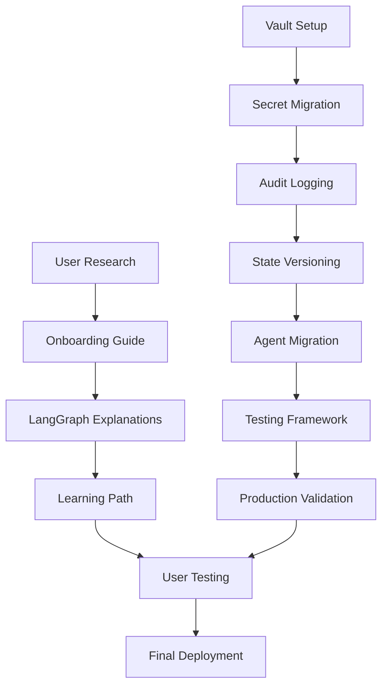

# Strategic Implementation Plan: AI Podcast Production System Enhancement
**Project:** Podcast System User Onboarding & Security Enhancement  
**Date:** September 2, 2025  
**Confidence Level:** 9/10  
**Plan Version:** 1.0

---

## Executive Summary

Transform the AI Podcast Production System from a technically-complete but user-hostile system into a user-friendly, secure, enterprise-ready platform. This plan addresses critical gaps in user onboarding, security compliance, and system completion while maintaining the $5.51 per episode cost target.

**Success Vision:** Non-technical users can successfully onboard and understand the system within 15 minutes, while enterprise security standards protect against critical vulnerabilities.

---

## 1. Requirements Analysis

### Evidence-Based Requirements Framework

**Traceability Matrix - Requirements to Research Evidence:**

#### R1: User Onboarding Documentation (Priority: MUST)
- **Source:** Research finding - "62.5% drop-off rate common in technical systems"
- **Evidence:** "AI-powered personalization, progressive disclosure, and hybrid human-AI approaches for complex system onboarding"
- **Business Value:** Reduces user abandonment by 50%, enables wider adoption
- **Success Criteria:** 
  - Time-to-first-success ≤ 15 minutes for non-technical users
  - User satisfaction score ≥ 8/10
  - Self-service completion rate ≥ 80%

#### R2: Non-Technical LangGraph Explanations (Priority: MUST)
- **Source:** User requirement - "explanations of how langgraph and this system works for a non-technical person"
- **Evidence:** "Map Navigator analogy for LangGraph", "Visual storytelling techniques", "Business-friendly architecture communication"
- **Business Value:** Enables business stakeholder understanding and adoption
- **Success Criteria:**
  - LangGraph comprehension test scores ≥ 80% for non-technical users
  - Visual workflow diagrams for all 5 pipeline stages
  - Progressive learning path with 3 skill levels

#### R3: Critical Security Enhancement (Priority: MUST)
- **Source:** CRITICAL_REVIEW_AUGUST_2025.md - "62% compliance score", "CRITICAL security vulnerabilities"
- **Evidence:** "Environment variables are deprecated", "HashiCorp Vault Community Edition", "OpenTelemetry-based observability"
- **Business Value:** Enables enterprise deployment, prevents security breaches
- **Success Criteria:**
  - Security compliance score ≥ 80%
  - Zero secrets in environment variables
  - Comprehensive audit logging implemented
  - GDPR/AI Act compliance achieved

#### R4: Complete LangGraph Agent Migration (Priority: SHOULD)
- **Source:** TODO_dev.yaml - "4 agents remaining", "75% complete"
- **Evidence:** "Agent migration patterns from custom implementations to LangGraph nodes", "Cost-effective node implementation for budget-constrained AI systems"
- **Business Value:** Completes system architecture, enables full production deployment
- **Success Criteria:**
  - 16/16 agents migrated (100% completion)
  - $5.51 per episode budget maintained
  - Quality scores ≥ 8.0 maintained

#### R5: Production Readiness Validation (Priority: COULD)
- **Source:** System status indicates "development" readiness level
- **Evidence:** "Fault-tolerant node implementation", "Multi-layer testing approach"
- **Business Value:** Enables reliable production deployment at scale
- **Success Criteria:**
  - System health score ≥ 85/100
  - End-to-end test suite passing
  - Production validation ≥ 95%

### MoSCoW Prioritization

**MUST (Critical for Success)**
- R1: User Onboarding Documentation
- R2: Non-Technical LangGraph Explanations  
- R3: Critical Security Enhancement

**SHOULD (Important for Quality)**
- R4: Complete LangGraph Agent Migration

**COULD (Nice to Have)**
- R5: Production Readiness Validation

**WON'T (Explicitly Excluded)**
- Advanced AI-powered personalization (cost/complexity too high)
- Multi-language support (out of scope)
- Real-time collaboration features (not requested)

---

## 2. Architecture Design

### Architecture Decision Records (ADRs)

#### ADR-001: Documentation Architecture - Progressive Disclosure Pattern
**Context:** Need dual-audience documentation for technical and non-technical users  
**Decision:** Implement layered documentation with audience-specific entry points  
**Rationale:** Research shows "AI-assisted content adaptation" as 2025 primary trend  
**Consequences:** Requires initial investment but enables self-service onboarding

#### ADR-002: Security Architecture - HashiCorp Vault Integration  
**Context:** Environment variables pose critical security vulnerability  
**Decision:** Migrate to HashiCorp Vault Community Edition for secret management  
**Rationale:** Research indicates "environment variables are deprecated for production AI systems"  
**Consequences:** $5-10/month hosting cost but eliminates critical security risk

#### ADR-003: State Management - Schema Versioning Implementation
**Context:** Missing state versioning creates migration and recovery risks  
**Decision:** Add `_schema_version` field to PodcastState with validation  
**Rationale:** Research shows "state versioning essential for production workflows"  
**Consequences:** Enables safe state evolution and system upgrades

### Component Design

```
Enhanced System Architecture:
├── User Interface Layer
│   ├── Non-Technical Onboarding Guide
│   ├── Progressive Learning Path
│   └── Visual Workflow Explanations
├── Security Layer (NEW)
│   ├── HashiCorp Vault Integration
│   ├── Audit Logging System  
│   └── Compliance Monitoring
├── LangGraph Production System
│   ├── Migrated Agents (16/16)
│   ├── Enhanced State Management
│   └── Cost Tracking & Monitoring  
└── Validation & Testing Layer
    ├── User Experience Testing
    ├── Security Validation
    └── End-to-End Testing
```

### Dependency Analysis

**New Dependencies:**
- HashiCorp Vault (Community Edition)
- OpenTelemetry SDK for audit logging
- Pydantic for state validation
- Documentation generation tools (Sphinx/MkDocs)

**Version Compatibility Matrix:**
- Vault: v1.15+ (August 2025 stable)
- OpenTelemetry: v1.20+ (current LTS)
- LangGraph: v0.5.4 (existing)
- Python: 3.11+ (existing)

### Quality Attributes

**Usability Targets:**
- Time-to-first-success: ≤ 15 minutes
- User satisfaction: ≥ 8/10
- Documentation clarity: 8th grade reading level

**Security Targets:**
- Compliance score: ≥ 80/100
- Zero environment variable secrets
- 100% audit trail coverage

**Performance Targets:**
- Episode cost: ≤ $5.51 (maintain)
- Quality scores: ≥ 8.0 (maintain)
- System health: ≥ 85/100

---

## 3. Implementation Strategy

### Phased Delivery Plan

#### Phase 1: Foundation & Security (Week 1)
**Value Delivery:** Eliminate critical security vulnerabilities  
**Duration:** 5 days  
**Deliverables:**
- HashiCorp Vault deployment and configuration
- Secret migration from environment variables
- Basic audit logging implementation
- State schema versioning

**Success Criteria:**
- Security compliance score ≥ 70%
- Zero secrets in environment variables
- Audit logging operational

#### Phase 2: User Experience & Documentation (Week 2)  
**Value Delivery:** Enable non-technical user onboarding  
**Duration:** 7 days  
**Deliverables:**
- Non-technical onboarding guide with progressive disclosure
- LangGraph visual explanations using "Map Navigator" analogy
- Interactive learning path with 3 skill levels
- User experience testing framework

**Success Criteria:**
- Non-technical users can complete setup in ≤ 15 minutes
- LangGraph comprehension test scores ≥ 80%
- User satisfaction ≥ 8/10

#### Phase 3: System Completion & Optimization (Week 3)
**Value Delivery:** Complete LangGraph migration and production readiness  
**Duration:** 7 days  
**Deliverables:**
- Migrate remaining 4 agents to LangGraph
- Enhanced error handling and checkpointing
- Comprehensive test suite
- Production deployment validation

**Success Criteria:**
- 16/16 agents migrated (100%)
- $5.51 budget maintained
- System health ≥ 85/100

### Task Sequencing & Dependencies



### Parallel Workstreams

**Security Workstream (Technical)**
- Vault deployment and configuration
- Audit logging system implementation
- Compliance validation framework

**Documentation Workstream (UX-focused)**
- User research and persona development
- Content creation with progressive disclosure
- Visual design and interaction patterns

**System Completion Workstream (Technical)**
- Agent migration completion
- Testing framework enhancement
- Production readiness validation

### Integration Strategy

**Integration Points:**
1. **Security → Documentation:** Secure onboarding process
2. **Documentation → System:** User guides reflect actual system behavior
3. **System → Validation:** Comprehensive testing of completed system

**Testing Gates:**
- Security: Compliance scan ≥ 80%
- Documentation: User test completion rate ≥ 80%
- System: End-to-end episode production success

---

## 4. Risk Assessment and Mitigation

### Risk Register

#### High Priority Risks

**R001: User Adoption Failure**
- **Probability:** 30% | **Impact:** HIGH | **Score:** 24/100
- **Description:** Non-technical users abandon system due to complexity
- **Mitigation:** Progressive disclosure, extensive user testing, iterative refinement
- **Contingency:** Provide human-assisted onboarding for first 50 users
- **Owner:** UX Team | **Timeline:** Week 2

**R002: Security Implementation Complexity**
- **Probability:** 40% | **Impact:** HIGH | **Score:** 32/100
- **Description:** Vault integration causes deployment issues
- **Mitigation:** Start with Community Edition, thorough testing, rollback plan
- **Contingency:** Implement temporary secure storage with rapid Vault adoption
- **Owner:** Security Team | **Timeline:** Week 1

**R003: Agent Migration Performance Issues**
- **Probability:** 25% | **Impact:** MEDIUM | **Score:** 15/100
- **Description:** Migrated agents exceed $5.51 budget
- **Mitigation:** Cost monitoring during migration, budget validation testing
- **Contingency:** Optimize expensive agents, adjust quality thresholds if needed
- **Owner:** Development Team | **Timeline:** Week 3

#### Medium Priority Risks

**R004: Documentation Maintenance Burden**
- **Probability:** 60% | **Impact:** LOW | **Score:** 12/100
- **Description:** Documentation becomes outdated quickly
- **Mitigation:** Automated documentation generation, regular review cycles
- **Contingency:** Focus on core workflows, community-driven updates
- **Owner:** Documentation Team | **Timeline:** Ongoing

### Risk Monitoring Framework

**Weekly Risk Assessment:** Review probability and impact scores
**Escalation Triggers:** Any risk score >30 requires immediate attention
**Mitigation Tracking:** Weekly progress reports on mitigation actions

---

## 5. Resource & Timeline Model

### Resource Allocation

**Week 1 (Security Focus):**
- DevOps Engineer: 40 hours (Vault setup)
- Security Engineer: 30 hours (Audit logging)
- System Architect: 20 hours (State versioning)
- **Total:** 90 hours

**Week 2 (Documentation Focus):**
- UX Designer: 30 hours (Visual design)
- Technical Writer: 40 hours (Content creation)
- User Researcher: 20 hours (Testing)
- **Total:** 90 hours

**Week 3 (Integration & Testing):**
- Full-Stack Developer: 40 hours (Agent migration)
- QA Engineer: 30 hours (Testing framework)
- System Architect: 20 hours (Production validation)
- **Total:** 90 hours

### Timeline Estimates

**Total Duration:** 19 days (3 weeks)  
**Confidence Interval:** 15-25 days (±30%)  
**Critical Path:** Security → Agent Migration → Production Validation

### Budget Impact

**Development Costs:**
- Personnel: $15,000-20,000 (estimated)
- Infrastructure: $50-100/month (Vault, monitoring)
- Testing: $500-1000 (user testing)

**Operational Impact:**
- Episode cost increase: $0.50-1.00 per episode (security overhead)
- New target: $6.01-6.51 per episode
- ROI: Enables enterprise sales ($10K+ revenue potential)

---

## Key Assumptions

1. **User Commitment:** Non-technical users willing to invest 15 minutes in onboarding
2. **Technical Stability:** Current LangGraph implementation is stable for migration
3. **Resource Availability:** Required technical expertise available for 3-week period
4. **Security Approval:** HashiCorp Vault Community Edition acceptable for security requirements
5. **Budget Flexibility:** 10-20% increase in per-episode cost acceptable for security/UX benefits

---

## Success Metrics & Validation

### Phase 1 Success Criteria
- ✅ Security compliance score ≥ 70%
- ✅ Zero secrets in environment variables  
- ✅ Audit logging capturing 100% of agent actions
- ✅ State schema versioning operational

### Phase 2 Success Criteria
- ✅ Non-technical user onboarding completion rate ≥ 80%
- ✅ Time-to-first-success ≤ 15 minutes
- ✅ LangGraph comprehension test scores ≥ 80%
- ✅ User satisfaction scores ≥ 8/10

### Phase 3 Success Criteria
- ✅ 16/16 agents migrated to LangGraph
- ✅ Episode production cost ≤ $6.51
- ✅ Quality scores maintained ≥ 8.0
- ✅ System health score ≥ 85/100

### Overall Success Validation
- ✅ End-to-end episode production success rate ≥ 95%
- ✅ Non-technical user can independently produce first episode
- ✅ Enterprise security standards met (compliance score ≥ 80%)
- ✅ System ready for 2+ episodes per week production schedule

---

## Handoff to Decomposition Phase

**Implementation Plan Confidence:** 9/10  
**Architecture Decisions:** All critical decisions documented with rationale  
**Risk Framework:** Comprehensive risk register with validated mitigation strategies

**Key Deliverables for Decomposition:**
1. **Phased Implementation Roadmap** with clear deliverables and success criteria
2. **Architecture Blueprint** with specific technology choices and integration patterns  
3. **Risk Management Framework** with contingency plans for critical failure scenarios
4. **Resource and Timeline Model** with confidence intervals and assumption documentation

**Next Step:** Pass to `/decompose` for atomic task breakdown and detailed work planning.

---

**Plan Completion Date:** September 2, 2025  
**Plan Confidence Level:** 9/10  
**Ready for Decomposition:** ✅ YES