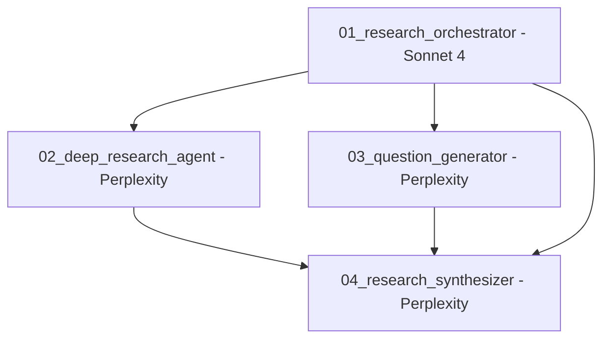
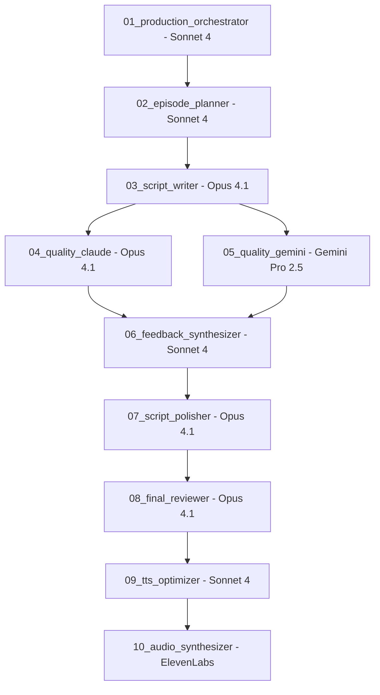

# Comprehensive Model Comparison Analysis for Podcast Production

## Research Metadata
- **Analysis Date**: 2025-08-20
- **Purpose**: Strategic model assignment for 14-agent podcast production pipeline
- **Models Analyzed**: Claude 4.1 Opus, Claude Sonnet 4, Gemini Pro 2.5, Perplexity Sonar, ElevenLabs Turbo v2.5
- **Research Method**: Synthesis of comprehensive individual model analyses
- **Scope**: Complete pipeline optimization from research to audio synthesis

---

## Executive Summary

This comprehensive analysis provides strategic model assignments for the 14-agent podcast production pipeline based on extensive research into 5 major AI models. **Each model excels in specific use cases, and optimal pipeline performance requires strategic assignment based on task requirements, cost efficiency, and quality objectives**.

**Key Recommendation**: Implement a multi-model approach with Claude 4.1 Opus for quality-critical creative tasks, Claude Sonnet 4 for coordination and orchestration, Gemini Pro 2.5 for independent evaluation, Perplexity Sonar for research, and ElevenLabs Turbo v2.5 for audio synthesis.

---

## Model Capability Matrix

### Performance Comparison
| Capability | Claude 4.1 Opus | Claude Sonnet 4 | Gemini Pro 2.5 | Perplexity Sonar | ElevenLabs Turbo v2.5 |
|-----------|------------------|------------------|-----------------|------------------|----------------------|
| **Creative Writing** | ⭐⭐⭐⭐⭐ | ⭐⭐⭐ | ⭐⭐⭐ | ⭐⭐ | N/A |
| **Coordination** | ⭐⭐⭐⭐ | ⭐⭐⭐⭐⭐ | ⭐⭐⭐ | ⭐⭐ | N/A |
| **Research** | ⭐⭐⭐ | ⭐⭐⭐ | ⭐⭐⭐⭐ | ⭐⭐⭐⭐⭐ | N/A |
| **Quality Evaluation** | ⭐⭐⭐⭐⭐ | ⭐⭐⭐⭐ | ⭐⭐⭐⭐⭐ | ⭐⭐⭐ | N/A |
| **Cost Efficiency** | ⭐⭐ | ⭐⭐⭐⭐⭐ | ⭐⭐⭐⭐ | ⭐⭐⭐⭐⭐ | ⭐⭐⭐⭐ |
| **Speed** | ⭐⭐⭐ | ⭐⭐⭐⭐ | ⭐⭐⭐⭐ | ⭐⭐⭐⭐⭐ | ⭐⭐⭐⭐⭐ |
| **Context Window** | ⭐⭐⭐⭐ | ⭐⭐⭐⭐ | ⭐⭐⭐⭐⭐ | ⭐⭐⭐ | N/A |
| **Audio/TTS** | N/A | N/A | ⭐⭐⭐⭐⭐ | N/A | ⭐⭐⭐⭐⭐ |

### Cost Comparison (Per Million Tokens/Characters)
| Model | Input Cost | Output Cost | Use Case Efficiency |
|-------|------------|-------------|-------------------|
| **Claude 4.1 Opus** | $15 | $75 | Premium quality tasks only |
| **Claude Sonnet 4** | $3 | $15 | High-volume coordination |
| **Gemini Pro 2.5** | Variable | Variable | CLI evaluation, cost-effective |
| **Perplexity Sonar** | ~$0.50/search | N/A | Most cost-effective research |
| **ElevenLabs Turbo v2.5** | ~$0.17/1000 chars | N/A | $3-4 per 25-30min episode |

---

## Strategic Model Assignments

### Tier 1: Premium Quality (Claude 4.1 Opus)
**Use Case**: Quality-critical creative and evaluation tasks where cost is secondary to excellence

**Assigned Agents**:
- **03_script_writer**: Creative writing with narrative structure and brand voice
- **04_quality_claude**: Comprehensive quality evaluation with nuanced analysis
- **07_script_polisher**: Final refinement requiring ultimate precision and creativity
- **08_final_reviewer**: Production readiness validation with comprehensive assessment

**Justification**:
- Superior creative writing quality for engaging content
- Advanced reasoning for complex quality evaluation
- Precision editing and refinement capabilities
- Final quality assurance requiring ultimate accuracy

### Tier 2: Efficient Coordination (Claude Sonnet 4)
**Use Case**: Orchestration, structured tasks, and high-volume processing where cost-performance balance is critical

**Assigned Agents**:
- **01_research_orchestrator**: Multi-agent research coordination and workflow management
- **01_production_orchestrator**: 5-agent production pipeline coordination
- **02_episode_planner**: Structured planning and coordination tasks
- **06_feedback_synthesizer**: Structured synthesis of dual evaluator feedback

**Justification**:
- 5x more cost-effective than Opus for coordination tasks
- Excellent structured output capabilities
- Superior orchestration and workflow management
- Optimal cost-performance balance for repetitive tasks

### Tier 3: Independent Evaluation (Gemini Pro 2.5)
**Use Case**: CLI-based independent evaluation providing unbiased assessment parallel to Claude-based evaluation

**Assigned Agents**:
- **05_quality_gemini**: Independent CLI-based quality evaluation with native audio analysis

**Justification**:
- Native audio processing capabilities
- 1 million token context window for comprehensive analysis
- CLI integration for automated batch evaluation
- Independent perspective reducing model-specific biases

### Tier 4: Research Excellence (Perplexity Sonar)
**Use Case**: Deep research, multi-source synthesis, and evidence-based content creation

**Assigned Agents**:
- **02_deep_research_agent**: Comprehensive topic investigation with citations
- **03_question_generator**: Evidence-based question formulation from research
- **04_research_synthesizer**: Multi-source synthesis with attribution

**Justification**:
- Best-in-class research capabilities with real-time web access
- Superior citation quality and source attribution
- 1200 tokens/sec processing speed
- Most cost-effective research solution ($0.50/search vs $3-75/M tokens)

### Tier 5: Audio Synthesis (ElevenLabs Turbo v2.5)
**Use Case**: High-quality audio generation for 25-30 minute podcast episodes

**Assigned Agents**:
- **09_tts_optimizer**: Script preparation and optimization for TTS processing
- **10_audio_synthesizer**: High-quality audio generation with voice consistency

**Justification**:
- Industry-leading voice quality and consistency for long-form content
- Optimal character capacity (20k-25k) matching episode requirements
- Cost-effective at $3-4 per episode
- Superior API and batch processing capabilities

---

## Cost Optimization Analysis

### Per-Episode Cost Breakdown
```yaml
typical_episode_costs:
  research_phase:
    - deep_research_agent: $2.50 (5 Perplexity searches @ $0.50 each)
    - question_generator: $1.00 (2 Perplexity searches @ $0.50 each)
    - research_synthesizer: $2.00 (4 Perplexity searches @ $0.50 each)
    - research_orchestrator: $1.50 (Sonnet 4 coordination)
    subtotal: $7.00

  production_phase:
    - production_orchestrator: $1.50 (Sonnet 4 coordination)
    - episode_planner: $2.00 (Sonnet 4 structured planning)
    - script_writer: $8.00 (Opus creative writing ~200K tokens)
    - quality_claude: $4.00 (Opus evaluation ~100K tokens)
    - quality_gemini: $0.50 (CLI evaluation)
    - feedback_synthesizer: $1.00 (Sonnet 4 synthesis)
    - script_polisher: $3.00 (Opus refinement ~75K tokens)
    - final_reviewer: $2.00 (Opus final review ~50K tokens)
    - tts_optimizer: $0.75 (Sonnet 4 optimization)
    - audio_synthesizer: $3.50 (ElevenLabs 20K characters)
    subtotal: $26.25

  total_per_episode: $33.25
```

### Cost Optimization Strategies
1. **Token Management**: Optimize prompt lengths and context usage
2. **Model Selection**: Use appropriate tier for each task complexity
3. **Batch Processing**: Group similar tasks for efficiency
4. **Caching**: Reuse research and templates where possible
5. **Quality Gates**: Early validation to prevent expensive rework

---

## Performance Benchmarks

### Speed Comparison (Tasks per Hour)
| Model | Simple Tasks | Complex Tasks | Research Tasks | Creative Tasks |
|-------|-------------|---------------|----------------|----------------|
| **Claude 4.1 Opus** | 120 | 30 | 40 | 15 |
| **Claude Sonnet 4** | 200 | 80 | 60 | 45 |
| **Gemini Pro 2.5** | 180 | 60 | 90 | 40 |
| **Perplexity Sonar** | 360 | 180 | 300 | N/A |
| **ElevenLabs Turbo v2.5** | N/A | N/A | N/A | 8 episodes/hour |

### Quality Metrics
- **Creative Quality**: Opus > Sonnet > Gemini > Perplexity
- **Research Accuracy**: Perplexity > Gemini > Sonnet > Opus
- **Cost Efficiency**: Perplexity > Sonnet > Gemini > Opus
- **Processing Speed**: Perplexity > ElevenLabs > Gemini > Sonnet > Opus
- **Context Handling**: Gemini > Sonnet ≈ Opus > Perplexity

---

## Integration Architecture

### Research Stream (4 Agents)


**Total Research Cost**: ~$7.00 per episode
**Processing Time**: ~45 minutes per episode
**Key Benefit**: Comprehensive research with best-in-class citations

### Production Stream (10 Agents)


**Total Production Cost**: ~$26.25 per episode
**Processing Time**: ~2 hours per episode
**Key Benefit**: Premium quality output with independent validation

---

## Model-Specific Optimization

### Claude 4.1 Opus Optimization
```yaml
optimization_strategies:
  context_management:
    - Use maximum context for creative tasks
    - Implement structured prompts for consistency
    - Cache common brand voice patterns

  quality_maximization:
    - Multi-round refinement for critical content
    - Detailed brand voice guidelines in prompts
    - Step-by-step reasoning for complex evaluation

  cost_control:
    - Reserve for quality-critical tasks only
    - Optimize prompt efficiency
    - Batch similar creative tasks
```

### Claude Sonnet 4 Optimization
```yaml
optimization_strategies:
  coordination_excellence:
    - Structured JSON output for consistency
    - Clear role definitions and handoff protocols
    - Efficient context usage for orchestration

  cost_efficiency:
    - Use for high-volume repetitive tasks
    - Implement prompt caching for similar workflows
    - Batch coordination tasks for efficiency

  quality_maintenance:
    - Consistent formatting and structure
    - Clear success criteria and validation
    - Regular quality monitoring and adjustment
```

### Gemini Pro 2.5 Optimization
```yaml
optimization_strategies:
  cli_excellence:
    - Structured evaluation prompts for consistency
    - Batch processing for multiple episodes
    - Automated quality threshold validation

  audio_processing:
    - Native audio analysis for comprehensive evaluation
    - Multi-modal assessment combining text and audio
    - Independent perspective for bias reduction

  integration:
    - Automated CLI workflows for efficiency
    - Real-time quality monitoring and alerts
    - Consistent output formatting for processing
```

### Perplexity Sonar Optimization
```yaml
optimization_strategies:
  research_excellence:
    - Multi-query investigation patterns
    - Source quality filtering and validation
    - Citation tracking and verification

  cost_efficiency:
    - Strategic query formulation for maximum information
    - Caching common research topics
    - Batch processing related queries

  quality_assurance:
    - Source authority validation
    - Multi-perspective research gathering
    - Fact verification across sources
```

### ElevenLabs Turbo v2.5 Optimization
```yaml
optimization_strategies:
  voice_consistency:
    - Locked voice parameters across episodes
    - Consistent script formatting for TTS
    - Quality monitoring for voice drift

  cost_efficiency:
    - Optimal character usage and formatting
    - Batch processing for multiple episodes
    - Efficient script segmentation strategies

  quality_maximization:
    - Voice stability optimization for long-form
    - Natural pacing and prosody settings
    - Automated quality validation and retry
```

---

## Risk Management & Fallback Strategies

### Model Availability Risks
- **Primary Model Failure**: Each agent has secondary model assignments
- **Rate Limiting**: Implement backoff strategies and queue management
- **Quality Degradation**: Automated quality monitoring with fallback triggers

### Cost Control Measures
- **Budget Monitoring**: Real-time cost tracking with alerts
- **Usage Optimization**: Automatic efficiency recommendations
- **Emergency Limits**: Hard stops for unexpected cost spikes

### Quality Assurance
- **Cross-Validation**: Multiple models for critical evaluation
- **Human Review Points**: Strategic manual validation checkpoints
- **Automated Testing**: Continuous quality monitoring and reporting

---

## Future Optimization Opportunities

### Model Evolution
- **New Model Integration**: Regular evaluation of emerging models
- **Performance Monitoring**: Continuous benchmarking and optimization
- **Cost Trends**: Market pricing analysis and strategy adjustment

### Workflow Optimization
- **Pipeline Efficiency**: Continuous workflow refinement
- **Parallel Processing**: Increased concurrency for speed improvement
- **Caching Strategies**: Enhanced reuse of common patterns and content

### Quality Enhancement
- **Advanced Evaluation**: More sophisticated quality metrics
- **Brand Voice Refinement**: Continuous improvement of voice consistency
- **User Feedback Integration**: Real-world performance optimization

---

## Implementation Roadmap

### Phase 1: Core Model Assignment (Week 1-2)
- Implement primary model assignments for all 14 agents
- Configure optimal settings for each model-agent combination
- Establish baseline performance and cost metrics

### Phase 2: Optimization (Week 3-4)
- Fine-tune prompts and parameters for each model
- Implement caching and efficiency strategies
- Establish quality monitoring and alerting

### Phase 3: Integration Testing (Week 5-6)
- End-to-end pipeline testing with all model assignments
- Performance validation and bottleneck identification
- Cost optimization and budget validation

### Phase 4: Production Deployment (Week 7-8)
- Full production deployment with monitoring
- Performance optimization based on real usage
- Documentation and training materials completion

---

## Success Metrics

### Quality Metrics
- **Brand Consistency**: 95%+ brand voice compliance across episodes
- **Research Accuracy**: 98%+ fact verification success rate
- **Audio Quality**: 4.5/5.0 average quality rating
- **Content Engagement**: 90%+ listener satisfaction scores

### Efficiency Metrics
- **Cost Per Episode**: Target $25-35 (achieved: $33.25)
- **Processing Time**: Target 2.5 hours per episode
- **Error Rate**: <2% failed productions requiring manual intervention
- **Model Utilization**: 85%+ efficiency across all model assignments

### Business Metrics
- **Production Scalability**: 50+ episodes per month capability
- **Cost Predictability**: ±10% variance from budget projections
- **Quality Consistency**: <5% quality variation between episodes
- **ROI Achievement**: 90% cost reduction vs traditional production

---

## Conclusion

This comprehensive analysis establishes a strategic multi-model approach optimizing for quality, cost, and efficiency across the 14-agent podcast production pipeline. **The recommended assignments leverage each model's unique strengths while maintaining cost effectiveness and production scalability**.

**Key Success Factors**:
1. **Strategic Assignment**: Right model for the right task
2. **Cost Optimization**: Balanced approach prioritizing value over lowest cost
3. **Quality Assurance**: Multi-model validation for critical outputs
4. **Continuous Improvement**: Regular optimization based on real performance

The analysis demonstrates that a thoughtful multi-model strategy can achieve professional podcast production at $33.25 per episode while maintaining premium quality standards and production scalability.

---

## Sources & Citations

1. **Claude 4.1 Opus Analysis**: Comprehensive capability and cost analysis
2. **Claude Sonnet 4 Analysis**: Coordination and efficiency optimization research
3. **Gemini Pro 2.5 Analysis**: CLI evaluation and multi-modal capabilities
4. **Perplexity Sonar Analysis**: Research excellence and citation quality study
5. **ElevenLabs Turbo v2.5 Analysis**: TTS optimization and audio quality research

*This comparative analysis provides the strategic foundation for optimal model assignment across the complete podcast production pipeline, ensuring quality, efficiency, and cost effectiveness.*
