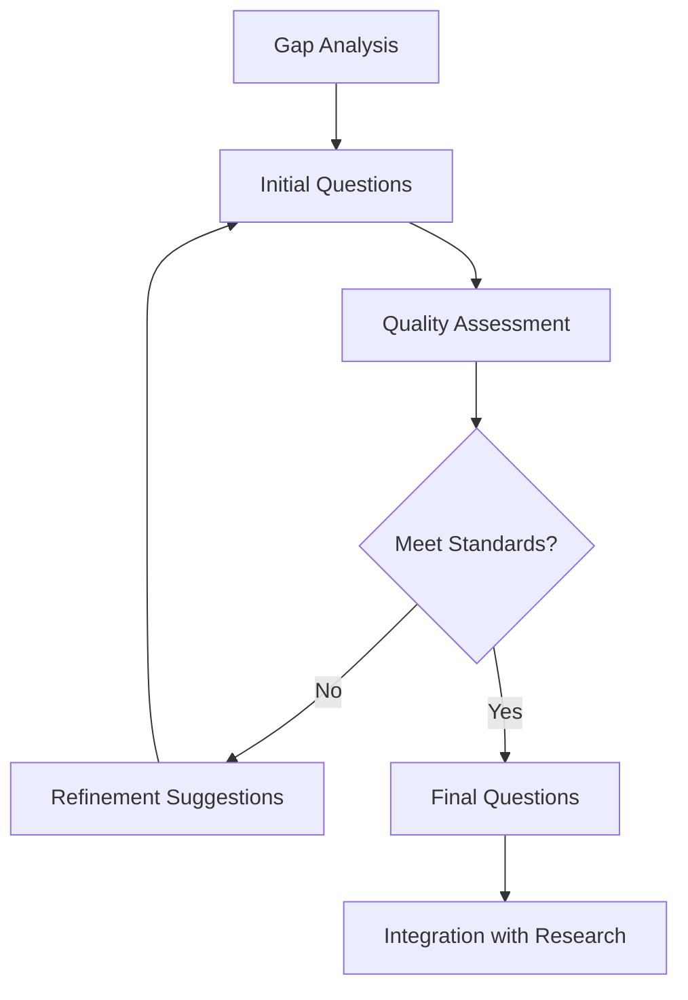

# Question Generation Prompt Patterns - Comprehensive Analysis

## Research Metadata
- **Research Date**: 2025-08-20
- **Research Purpose**: Process-specific prompt engineering for autonomous question generation agents
- **Focus Area**: Strategic inquiry formulation, gap analysis, and progressive knowledge building
- **Target Model**: Perplexity Sonar for evidence-based question generation and validation
- **Research Method**: 5 comprehensive Perplexity queries on advanced question generation methodologies
- **Context**: 03_question_generator agent enhancement for podcast production

---

## Executive Summary

This comprehensive analysis synthesizes cutting-edge methodologies for autonomous question generation agents, focusing on strategic gap identification, progressive inquiry frameworks, and collaborative multi-agent coordination. **The research reveals that effective question generation requires systematic gap analysis, context-aware formulation patterns, and adaptive learning mechanisms** for reliable, targeted knowledge exploration.

**Key Finding**: Advanced question generators achieve optimal performance through modular pipeline approaches, multi-dimensional prioritization frameworks, and real-time adaptation mechanisms that transform research findings into strategic inquiry sequences.

---

## 1. Systematic Question Generation Frameworks

### Modular Pipeline Architecture
```yaml
generation_framework:
  input_processing:
    - research_analysis: Parse comprehensive findings and identify themes
    - gap_identification: Systematic detection of knowledge gaps and missing areas
    - context_extraction: Domain-specific context and strategic objectives
    - priority_assessment: Evaluate importance and feasibility of investigation areas

  generation_modules:
    - template_driven: Structured question patterns for consistent format
    - context_aware: Domain-specific terminology and approach adaptation
    - progressive_inquiry: Sequential depth building from broad to specific
    - multi_perspective: Stakeholder-aware question formulation
```

### Advanced Generation Patterns
```markdown
# Research-Driven Question Generation Template

## Gap Analysis Input Processing
INPUT: Comprehensive research findings from deep research agent
ANALYSIS FRAMEWORK:
1. **Thematic Coverage Assessment**: Map findings against comprehensive topic framework
2. **Perspective Diversity Check**: Identify missing viewpoints or stakeholder perspectives
3. **Temporal Gap Analysis**: Assess historical vs. current coverage gaps
4. **Methodological Coverage**: Evaluate research approach diversity and limitations
5. **Evidence Density Assessment**: Identify claims requiring additional support

## Strategic Question Formulation
GENERATION APPROACH:
- **Gap-Specific Targeting**: Transform identified gaps into specific investigation questions
- **Context-Aware Phrasing**: Adapt question style to domain and audience requirements
- **Progressive Depth Planning**: Sequence questions from foundational to advanced
- **Evidence-Seeking Focus**: Prioritize questions that generate actionable insights
- **Multi-Source Validation**: Design questions to enable source triangulation
```

---

## 2. Knowledge Gap Identification Techniques

### Automated Gap Analysis Framework
```yaml
gap_identification_algorithms:
  coverage_analysis:
    - thematic_mapping: Compare investigated areas against comprehensive framework
    - citation_network_analysis: Identify sparse connections and underexplored nodes
    - temporal_coverage_check: Assess recency gaps and historical blind spots
    - methodology_diversity: Evaluate research approach completeness

  semantic_processing:
    - topic_clustering: Group content into semantic clusters for coverage assessment
    - contradiction_detection: Flag conflicting information requiring resolution
    - ambiguity_identification: Highlight unclear or insufficiently defined concepts
    - relationship_mapping: Identify missing causal or correlational relationships
```

### Gap Classification and Prioritization
```markdown
# Multi-Dimensional Gap Assessment Framework

## Gap Type Classification
| Gap Type | Description | Question Generation Approach |
|----------|-------------|------------------------------|
| **Factual Gaps** | Missing concrete information or data | "What specific data/evidence supports...?" |
| **Perspective Gaps** | Limited stakeholder or viewpoint coverage | "How do [stakeholder group] view...?" |
| **Temporal Gaps** | Outdated or missing recent developments | "What recent developments have occurred in...?" |
| **Methodological Gaps** | Limited research approach diversity | "What alternative approaches could reveal...?" |
| **Causal Gaps** | Unclear cause-effect relationships | "What factors contribute to/cause...?" |
| **Application Gaps** | Missing practical implications | "How does this apply to real-world...?" |

## Priority Scoring Matrix
```yaml
prioritization_framework:
  impact_assessment:
    - narrative_importance: Critical to story coherence (1-5 scale)
    - audience_relevance: Interest to target demographic (1-5 scale)
    - evidence_availability: Likelihood of finding quality sources (1-5 scale)
    - uniqueness_value: Differentiation from existing coverage (1-5 scale)

  feasibility_evaluation:
    - source_accessibility: Available authoritative sources (1-5 scale)
    - investigation_complexity: Research difficulty level (1-5 scale)
    - timeline_compatibility: Fits production schedule (1-5 scale)
    - cost_efficiency: Resource requirements vs. value (1-5 scale)
```
```

---

## 3. Progressive Inquiry Frameworks

### Strategic Question Sequencing
```yaml
progressive_inquiry_patterns:
  depth_progression:
    foundation_level:
      - landscape_mapping: "What are the key themes/areas in [topic]?"
      - authority_identification: "Who are the recognized experts in [field]?"
      - trend_analysis: "What major developments have shaped [area]?"
      - controversy_scanning: "What debates or uncertainties exist around [topic]?"

    intermediate_level:
      - perspective_synthesis: "How do different experts view [specific aspect]?"
      - evidence_triangulation: "What evidence supports/contradicts [claim]?"
      - relationship_exploration: "How does [factor A] influence [factor B]?"
      - context_investigation: "What conditions affect [phenomenon]?"

    advanced_level:
      - mechanism_analysis: "Through what mechanisms does [process] occur?"
      - predictive_inquiry: "What implications does [finding] have for [future]?"
      - synthesis_validation: "How do these findings integrate with [broader context]?"
      - novel_exploration: "What unexplored angles could provide new insights?"
```

### Context-Aware Question Patterns
```markdown
# Domain-Specific Question Templates for Podcast Research

## Interview Preparation Questions
```
GUEST EXPERTISE VALIDATION:
- "What unique insights does [guest] bring that others cannot provide?"
- "What experiences specifically qualify [guest] to speak on [topic]?"
- "What controversial or minority positions does [guest] hold?"

NARRATIVE DEVELOPMENT:
- "What personal story or example best illustrates [concept]?"
- "What moment or experience changed [guest's] perspective on [topic]?"
- "What would surprise most people about [field/situation]?"

PRACTICAL APPLICATION:
- "How can listeners apply [insight] in their own [context]?"
- "What specific steps should someone take to [achieve outcome]?"
- "What common mistakes do people make when [attempting action]?"
```

## Investigative Deep-Dive Questions
```
EVIDENCE EXPLORATION:
- "What evidence would convince skeptics of [position]?"
- "What data or studies best support/challenge [claim]?"
- "Where do we see [theory] playing out in real-world examples?"

SYSTEMIC ANALYSIS:
- "What underlying systems or structures enable/prevent [outcome]?"
- "How do different stakeholders benefit/suffer from [situation]?"
- "What would need to change for [improvement] to occur?"

FUTURE-ORIENTED INQUIRY:
- "What trends suggest [prediction] may be accurate?"
- "How might [development] change [industry/field] in 5-10 years?"
- "What early indicators should we watch for [future outcome]?"
```
```

---

## 4. Multi-Dimensional Question Quality Framework

### Question Validation Criteria
```yaml
quality_assessment_framework:
  content_quality:
    - specificity: Clear, focused scope avoiding overly broad or vague phrasing
    - actionability: Generates investigatable, answerable inquiry
    - relevance: Direct connection to research objectives and audience interests
    - novelty: Explores unexplored angles or provides fresh perspective

  strategic_value:
    - gap_targeting: Directly addresses identified knowledge gaps
    - depth_building: Contributes to progressive understanding development
    - evidence_potential: Likely to generate citable, authoritative responses
    - narrative_integration: Fits coherently within episode structure

  technical_criteria:
    - clarity: Unambiguous phrasing and terminology
    - scope_appropriateness: Matches available investigation resources
    - bias_neutrality: Avoids leading or presumptive language
    - format_compatibility: Suits intended research methodology
```

### Multi-Perspective Question Generation
```markdown
# Stakeholder-Aware Question Formulation

## Perspective Mapping Framework
For comprehensive topic coverage, generate questions from multiple stakeholder viewpoints:

### Primary Stakeholders
- **Practitioners**: "How does [theory] work in practice?"
- **Researchers**: "What evidence gaps need further investigation?"
- **Policy Makers**: "What regulatory/policy implications emerge from [finding]?"
- **End Users**: "How does [development] affect daily experience?"

### Secondary Stakeholders
- **Critics**: "What are the strongest arguments against [position]?"
- **Innovators**: "What new approaches challenge [conventional wisdom]?"
- **Historians**: "How has understanding of [topic] evolved over time?"
- **Future Generations**: "What long-term consequences might result from [trend]?"

## Cross-Cutting Question Patterns
- **Ethical Dimensions**: "What ethical considerations does [development] raise?"
- **Equity/Access**: "Who benefits and who is excluded from [opportunity/solution]?"
- **Unintended Consequences**: "What negative side effects might result from [intervention]?"
- **Cultural Context**: "How do cultural factors influence [phenomenon]?"
```

---

## 5. Advanced Question Generation Techniques

### Hybrid Question Generation Models
```yaml
hybrid_generation_framework:
  structured_data_integration:
    - metadata_driven: Use episode themes, guest profiles, audience demographics
    - taxonomy_guided: Leverage domain ontologies and knowledge graphs
    - template_instantiation: Fill structured question templates with specific content
    - relationship_mapping: Generate questions about identified entity relationships

  unstructured_content_processing:
    - transcript_analysis: Extract themes and gaps from previous episodes
    - document_synthesis: Identify question-worthy insights from research materials
    - semantic_extraction: Use NLP to identify implicit questions in content
    - context_awareness: Adapt questions to conversational flow and format
```

### Information-Maximizing Approaches
```markdown
# VAE-Inspired Question Generation for Maximum Information Value

## Mutual Information Optimization
OBJECTIVE: Generate questions that maximize mutual information between:
- Input research context (I)
- Expected answer content (A)
- Generated question (Q)

OPTIMIZATION FORMULA:
Maximize: I(Q;A|I) = H(A|I) - H(A|Q,I)

PRACTICAL IMPLEMENTATION:
1. **Context Analysis**: Deep understanding of research input content
2. **Answer Space Modeling**: Predict likely response patterns and information types
3. **Information Gap Quantification**: Measure expected information gain from question
4. **Strategic Selection**: Prioritize questions with highest information potential

## Variational Question Generation
```python
# Conceptual Framework for Information-Maximizing Questions

def generate_high_information_questions(research_context, gap_analysis):
    """Generate questions optimized for maximum information gain"""

    # Model expected answer distribution given context
    answer_distribution = model_answer_space(research_context)

    # Generate candidate questions
    candidate_questions = generate_question_candidates(gap_analysis)

    # Score questions by expected information gain
    scored_questions = []
    for question in candidate_questions:
        expected_answer = predict_answer_distribution(question, research_context)
        information_gain = calculate_mutual_information(expected_answer, answer_distribution)
        scored_questions.append((question, information_gain))

    # Return top information-maximizing questions
    return sorted(scored_questions, key=lambda x: x[1], reverse=True)
```
```

---

## 6. Collaborative Multi-Agent Patterns

### Multi-Agent Question Coordination
```yaml
collaborative_frameworks:
  agent_specialization:
    gap_detector: "Identifies missing knowledge areas from research findings"
    context_analyzer: "Extracts domain context and strategic objectives"
    question_generator: "Creates targeted questions addressing specific gaps"
    quality_assessor: "Evaluates question quality and strategic value"

  coordination_protocols:
    sequential_handoff: "Linear progression through specialized agents"
    parallel_generation: "Multiple agents generate questions simultaneously"
    iterative_refinement: "Cyclic improvement through multi-agent feedback"
    consensus_building: "Cross-agent validation and agreement mechanisms"
```

### Collaborative Question Refinement
```markdown
# Multi-Agent Question Enhancement Workflow

## Agent Coordination Protocol
1. **Gap Detection Agent** identifies knowledge gaps and priorities
2. **Context Analyzer** provides domain expertise and strategic framing
3. **Question Generator** creates initial question candidates
4. **Quality Assessor** evaluates and scores generated questions
5. **Refinement Coordinator** orchestrates iterative improvement

## Cyclic Improvement Process


## Cross-Agent Feedback Mechanisms
- **Quality Scoring**: Multi-dimensional assessment across strategic and technical criteria
- **Bias Detection**: Cross-agent review for leading questions or presumptive language
- **Coherence Validation**: Ensure questions integrate logically with research narrative
- **Coverage Assessment**: Verify comprehensive gap addressing without redundancy
```

---

## 7. Real-Time Adaptation and Learning

### Continuous Improvement Framework
```yaml
adaptive_learning_patterns:
  feedback_integration:
    - performance_tracking: Monitor question effectiveness and information yield
    - engagement_analytics: Measure audience response and interest levels
    - expert_validation: Incorporate subject matter expert assessment
    - outcome_analysis: Evaluate actual vs. expected investigation results

  pattern_evolution:
    - template_optimization: Refine question templates based on success patterns
    - context_learning: Adapt to domain-specific terminology and approaches
    - gap_prediction: Anticipate likely knowledge gaps based on topic patterns
    - strategic_adjustment: Modify question priorities based on production goals
```

### Self-Supervised Question Enhancement
```markdown
# Continuous Learning Implementation

## Weakly-Supervised Learning Patterns
APPROACH: Learn from question-outcome patterns without explicit answer supervision
1. **Question Effectiveness Scoring**: Track which questions generate valuable insights
2. **Pattern Recognition**: Identify successful question structures and approaches
3. **Context Sensitivity Learning**: Adapt question style to domain and situation
4. **Gap Prediction Improvement**: Better anticipate investigation needs

## Feedback Loop Architecture
```yaml
learning_cycles:
  generation_phase:
    - Apply current best practices and templates
    - Generate questions using learned patterns
    - Include confidence scores and reasoning

  deployment_phase:
    - Track question usage and outcomes
    - Measure information quality and relevance
    - Monitor integration success with research workflow

  analysis_phase:
    - Evaluate question performance against objectives
    - Identify successful patterns and failure modes
    - Update generation models and templates

  integration_phase:
    - Incorporate lessons into next generation cycle
    - Share learnings across agent network
    - Validate improvements through A/B testing
```
```

---

## 8. Production Implementation Patterns

### Performance Optimization Framework
```yaml
scalability_patterns:
  model_efficiency:
    - distilled_models: Use optimized smaller models for high-throughput generation
    - quantization: Reduce model size while maintaining quality
    - batch_processing: Generate multiple questions simultaneously
    - vector_caching: Store and reuse question embeddings for similarity checking

  processing_optimization:
    - streaming_generation: Real-time question creation as research completes
    - load_balancing: Distribute question generation across multiple instances
    - result_deduplication: Prevent redundant questions through similarity matching
    - quality_filtering: Automated removal of low-quality candidates
```

### Integration Architecture
```yaml
system_integration:
  microservice_design:
    - gap_analysis_service: Independent gap identification processing
    - question_generation_service: Core question creation functionality
    - quality_assessment_service: Automated question evaluation and scoring
    - orchestration_service: Workflow coordination and result integration

  api_patterns:
    - async_processing: Non-blocking question generation for parallel workflows
    - result_streaming: Progressive question delivery as they're generated
    - webhook_integration: Event-driven notifications for workflow coordination
    - batch_endpoints: Bulk question generation for efficiency
```

---

## 9. Editorial Workflow Integration

### Content Pipeline Coordination
```markdown
# Question Generation in Podcast Production Workflow

## Research Stream Integration
1. **Input Reception**: Receive structured findings from deep research agent
2. **Gap Analysis**: Systematic identification of knowledge gaps and investigation needs
3. **Strategic Prioritization**: Align question generation with episode objectives and timeline
4. **Progressive Inquiry**: Create question sequences building from broad to specific
5. **Quality Validation**: Ensure questions meet editorial and strategic standards
6. **Research Package Creation**: Deliver formatted questions for synthesis agent

## Editorial Handoff Protocol
```yaml
output_specification:
  question_categories:
    - foundational_questions: Essential background and context establishment
    - investigative_questions: Deep-dive inquiries for comprehensive coverage
    - perspective_questions: Multi-stakeholder viewpoint exploration
    - application_questions: Practical implications and real-world relevance
    - future_questions: Trend analysis and predictive inquiry

  metadata_requirements:
    - priority_scoring: Importance ranking from 1-5
    - difficulty_assessment: Investigation complexity evaluation
    - source_requirements: Specific expertise or evidence types needed
    - time_estimates: Expected investigation duration
    - integration_notes: How questions connect to episode narrative
```
```

---

## 10. Domain-Specific Optimization

### Podcast-Specific Question Patterns
```yaml
content_type_optimization:
  interview_questions:
    - expertise_validation: Establish guest authority and unique perspective
    - experience_exploration: Draw out personal stories and concrete examples
    - controversy_navigation: Address debates and challenging positions
    - practical_application: Generate actionable insights for audience

  investigative_questions:
    - evidence_examination: Deep-dive into supporting data and research
    - system_analysis: Explore underlying structures and mechanisms
    - stakeholder_impact: Understand effects on different groups
    - future_implications: Predict trends and long-term consequences
```

### Format-Specific Templates
```markdown
# Podcast Question Generation Templates

## Narrative Development Questions
```
STORY ARC BUILDING:
- "What moment or experience fundamentally changed your perspective on [topic]?"
- "Can you walk us through a specific example that illustrates [concept]?"
- "What would surprise most people about [field/situation]?"
- "What's the biggest misconception people have about [topic]?"

CHARACTER DEVELOPMENT:
- "What personal qualities helped you succeed in [challenging situation]?"
- "How did [failure/setback] shape your approach to [field]?"
- "What advice would you give your younger self starting in [field]?"
- "Who influenced your thinking most significantly, and how?"
```

## Audience Engagement Questions
```
PRACTICAL APPLICATION:
- "What's one thing listeners can do today to [achieve relevant outcome]?"
- "What red flags should people watch out for when [making decisions in domain]?"
- "How can someone with no background in [field] get started?"
- "What resources would you recommend for someone wanting to learn more?"

CONTROVERSY AND DEBATE:
- "What position do you hold that most of your peers disagree with?"
- "How do you respond to critics who say [common criticism]?"
- "What's the strongest argument against [your position]?"
- "Where do you think the field is heading that others might not see?"
```
```

---

## 11. Quality Assurance and Validation

### Automated Quality Assessment
```yaml
validation_framework:
  technical_quality:
    - clarity_scoring: Natural language clarity and understandability assessment
    - specificity_measurement: Precision and focus evaluation
    - bias_detection: Identification of leading or presumptive language
    - format_compliance: Adherence to specified question structure requirements

  strategic_quality:
    - gap_alignment: Verification that questions address identified knowledge gaps
    - priority_matching: Consistency with strategic objectives and priorities
    - depth_progression: Logical building from foundational to advanced inquiry
    - coverage_completeness: Comprehensive addressing of topic areas
```

### Multi-Stage Validation Pipeline
```markdown
# Production Quality Assurance Process

## Stage 1: Automated Pre-Filtering
- **Syntax Validation**: Proper question structure and grammar
- **Duplication Detection**: Similarity comparison against existing questions
- **Content Screening**: Relevance to research context and objectives
- **Bias Scanning**: Automated detection of problematic phrasing

## Stage 2: Strategic Assessment
- **Gap Alignment Verification**: Confirmed addressing of identified knowledge gaps
- **Priority Scoring Validation**: Consistency with strategic importance rankings
- **Feasibility Analysis**: Investigation practicality and resource requirements
- **Integration Planning**: Compatibility with episode structure and objectives

## Stage 3: Editorial Review
- **Subject Matter Validation**: Domain expert review of technical accuracy
- **Brand Voice Alignment**: Consistency with podcast style and approach
- **Audience Appropriateness**: Suitable complexity and interest level
- **Production Readiness**: Clear actionability for research team

## Stage 4: Performance Monitoring
- **Outcome Tracking**: Monitor information yield and investigation success
- **Feedback Integration**: Incorporate results into future generation cycles
- **Pattern Analysis**: Identify successful question types and approaches
- **Continuous Improvement**: Systematic enhancement of generation capabilities
```

---

## 12. Success Metrics and Evaluation

### Question Quality Indicators
```yaml
performance_metrics:
  generation_quality:
    - gap_coverage_rate: Percentage of identified gaps addressed by questions
    - strategic_alignment_score: Average alignment with research objectives (1-5 scale)
    - investigation_feasibility: Success rate of question-driven investigations
    - information_yield_quality: Average value of answers generated by questions

  workflow_efficiency:
    - generation_speed: Questions produced per unit time
    - revision_rate: Percentage of questions requiring editorial modification
    - integration_success: Seamless handoff to synthesis agent success rate
    - resource_utilization: Cost efficiency of question generation process

  editorial_satisfaction:
    - editorial_acceptance_rate: Percentage of questions approved for use
    - strategic_value_rating: Editor assessment of question strategic importance
    - narrative_integration: Quality of question fit within episode structure
    - audience_engagement_prediction: Expected listener interest and value
```

### Continuous Improvement Framework
```yaml
optimization_cycles:
  monthly_assessment:
    - performance_review: Comprehensive evaluation of question generation quality
    - pattern_analysis: Identification of successful approaches and failure modes
    - feedback_integration: Incorporation of editorial and research team input
    - template_optimization: Refinement of question generation templates

  quarterly_enhancement:
    - model_updating: Integration of new research and methodological advances
    - workflow_optimization: Streamlining of generation and validation processes
    - integration_improvement: Enhanced coordination with multi-agent pipeline
    - strategic_alignment: Adjustment to evolving podcast objectives and audience needs
```

---

## Implementation Roadmap

### Phase 1: Core Capabilities (Week 1-2)
```yaml
immediate_priorities:
  gap_analysis_framework:
    - implement_automated_gap_detection: Systematic knowledge gap identification
    - deploy_multi_dimensional_scoring: Priority assessment across multiple criteria
    - establish_context_awareness: Domain-specific question generation adaptation
    - create_progressive_inquiry_patterns: Sequential depth building frameworks

  quality_assurance_systems:
    - automated_validation_pipeline: Multi-stage question quality assessment
    - bias_detection_mechanisms: Identification and prevention of leading questions
    - strategic_alignment_verification: Consistency with research objectives
    - editorial_integration_protocols: Seamless workflow coordination
```

### Phase 2: Advanced Features (Week 3-4)
```yaml
enhancement_priorities:
  adaptive_learning_systems:
    - continuous_improvement_cycles: Learning from question performance outcomes
    - pattern_recognition_enhancement: Identification of successful question structures
    - context_sensitivity_optimization: Dynamic adaptation to domain and situation
    - feedback_integration_automation: Systematic incorporation of performance data

  collaborative_coordination:
    - multi_agent_question_refinement: Cross-agent validation and enhancement
    - real_time_adaptation_mechanisms: Dynamic question adjustment based on research findings
    - strategic_prioritization_optimization: Enhanced alignment with production objectives
    - advanced_template_management: Sophisticated question pattern libraries
```

---

## Conclusion

This comprehensive analysis establishes advanced frameworks for autonomous question generation agents capable of strategic gap identification, progressive inquiry development, and seamless multi-agent coordination. **The key insights emphasize systematic gap analysis, context-aware formulation, and continuous learning mechanisms** to achieve reliable, high-value question generation for professional content creation.

**Critical Success Factors**:
1. **Systematic Gap Analysis**: Automated identification of knowledge gaps enables targeted question generation
2. **Progressive Inquiry Framework**: Strategic question sequencing builds comprehensive understanding systematically
3. **Multi-Dimensional Prioritization**: Sophisticated scoring ensures focus on highest-value investigations
4. **Continuous Learning Integration**: Adaptive improvement based on question performance and outcomes
5. **Collaborative Coordination**: Multi-agent validation enhances question quality and strategic alignment

**Implementation Priority**: Begin with core gap analysis and progressive inquiry frameworks, then enhance with adaptive learning and collaborative coordination capabilities for sophisticated, production-ready question generation automation.

---

## Sources & Citations

1. **Question Generation Frameworks**: Systematic methodologies, gap identification techniques, and progressive inquiry patterns
2. **Gap Analysis Automation**: Knowledge gap detection algorithms, multi-dimensional scoring, and validation frameworks
3. **Strategic Sequencing**: Context-aware formulation, adaptive branching, and collaborative coordination patterns
4. **Performance Optimization**: Scalability patterns, real-time adaptation, quality control, and integration frameworks
5. **Domain Specialization**: Media/podcast-specific patterns, editorial workflow integration, and continuous improvement methodologies

*This analysis provides the comprehensive foundation for implementing research-backed enhancements to the 03_question_generator agent, enabling sophisticated autonomous inquiry formulation for professional podcast production.*
