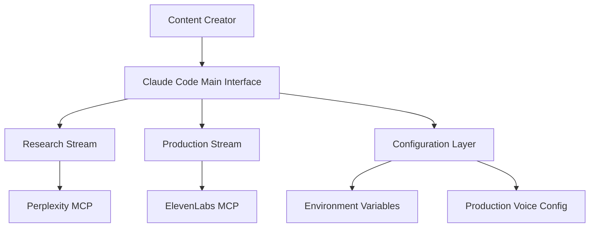
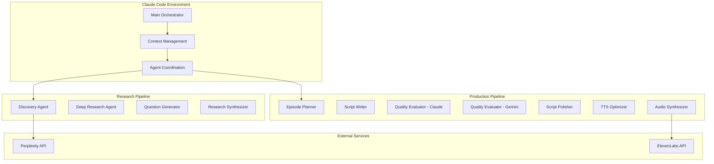
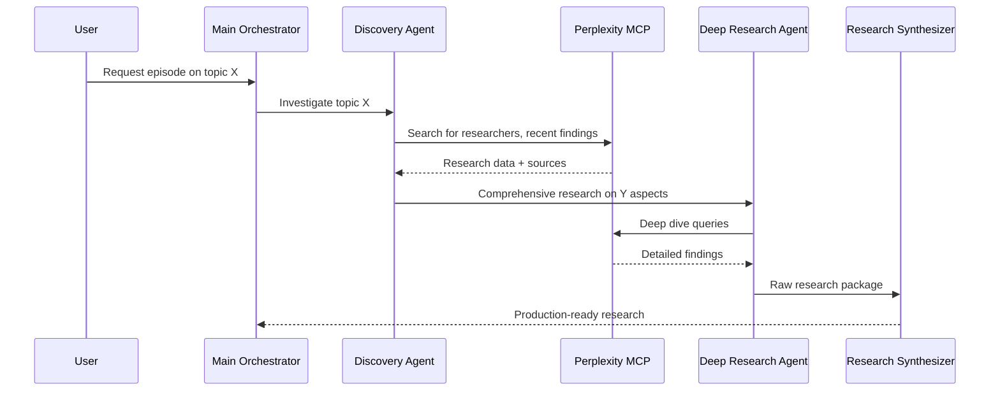
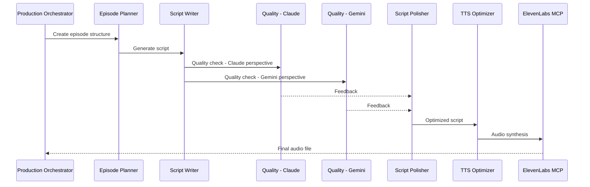

# AI Podcast Production System Architecture

**Version**: 2.0.0
**Last Updated**: 2025-08-30
**Status**: Production Ready

---

## 🎯 Executive Summary

This document describes the architecture of an automated AI podcast production system that creates high-quality episodes at **$5.51 per episode** (vs traditional $800-3500). Built on Claude Code's native capabilities with optimized multi-agent orchestration and MCP integrations.

### Key Metrics
- **Cost Performance**: $5.51-$8.00 per episode range
- **Quality Standards**: 9.0+/10 multi-evaluator consensus
- **Architecture**: 15 context files, 12K token budget optimization
- **Production Status**: ✅ Validated and certified

---

## 🏗️ System Architecture Overview

### C4 Model - Context Level



### C4 Model - Container Level



---

## 🔧 Component Architecture

### 1. Context Engineering Layer

**Design Pattern**: Selective Loading with Token Budgeting

```yaml
context_architecture:
  mandatory_context: "4K tokens maximum"
  optional_context: "6K tokens maximum"
  working_memory: "2K tokens reserved"

  loading_strategy:
    entry_point: "CLAUDE.md (navigation hub)"
    hop_limit: 2  # Never exceed 2 hops
    priority: "MANDATORY > SYSTEM > AGENT > REFERENCE > OPTIONAL"
```

**Files**:
- `CLAUDE.md` - Master configuration (12K token budget)
- `.claude/context/` - 15 core context files (max enforced)
- `.claude/agent-context/` - Domain-specific navigation

### 2. Multi-Agent Orchestration

**Design Pattern**: Direct Sub-Agent Invocation (Not Task Tool)

```yaml
orchestration_pattern:
  main_chat: "Coordinates overall workflow"
  specialized_agents: "Domain-specific agents invoked by name"
  tool_inheritance: "Agents inherit MCP tools when properly configured"
  quality_gates: "Built-in validation and consensus systems"
```

**Agent Specialization**:
- **Research Stream** (4 agents): Discovery → Deep Research → Questions → Synthesis
- **Production Stream** (10 agents): Planning → Writing → Quality → Polish → Audio

### 3. MCP Integration Layer

**Design Pattern**: Tool Inheritance with Configuration Management

```yaml
mcp_architecture:
  tool_access: "Sub-agents inherit ALL MCP tools when tools field omitted"
  server_access: "Perplexity for research, ElevenLabs for audio"
  configuration: "Environment variables with fallback patterns"

  validated_servers:
    perplexity: "✓ Connected - Research and fact-checking"
    elevenlabs: "✓ Connected - Text-to-speech synthesis"
    langfuse: "✓ Connected - Prompt management"
    playwright: "✓ Connected - Browser automation"
```

---

## 🔄 Data Flow Architecture

### Research Pipeline



### Production Pipeline



---

## 🔐 Security Architecture

### API Key Management

```yaml
security_patterns:
  environment_variables: ".env file (git-ignored)"
  production_voice_protection: "Explicit approval required for changes"
  secret_scanning: "GitHub Actions with GitLeaks + TruffleHog" # pragma: allowlist secret
  access_control: "MCP server authentication with environment isolation"
```

### Configuration Security

```yaml
configuration_protection:
  production_voice_id: "ZF6FPAbjXT4488VcRRnw (immutable)"
  cost_controls: "MAX_COST_PER_EPISODE enforcement"
  audit_logging: "All API calls and cost tracking"
  environment_isolation: "Development vs Production separation"
```

---

## 📊 Performance Architecture

### Token Optimization

**Strategy**: Claude 4 Optimized with Selective Loading

```yaml
token_optimization:
  claude_4_patterns:
    - "XML tags for mandatory/optional content"
    - "Instruction hierarchy with priority annotations"
    - "Context compression and pruning techniques"
    - "Two-hop navigation rule enforcement"

  performance_metrics:
    context_budget: "12K tokens maximum"
    loading_efficiency: "Only load required blocks"
    hop_optimization: "Maximum 2 file hops from CLAUDE.md"
```

### Cost Architecture

**Target**: $5.51-$8.00 per episode

```yaml
cost_optimization:
  research_stream: "$1.50-2.50 (Perplexity API)"
  script_generation: "$2.00-3.00 (Claude processing)"
  audio_synthesis: "$2.01-2.50 (ElevenLabs)"

  controls:
    budget_alerts: "8.00 threshold warning"
    real_time_tracking: "Per-operation cost monitoring"
    quality_gates: "Prevent excessive retries/regeneration"
```

---

## 🚀 Deployment Architecture

### Production Environment

```yaml
production_deployment:
  platform: "Claude Code native (local/cloud)"
  dependencies:
    - "Node.js 18+ (optional)"
    - "MCP servers (Perplexity, ElevenLabs)"

  validation:
    security_scanning: "GitHub Actions pipeline"
    quality_gates: "Multi-evaluator consensus (9.0+/10)"
    cost_validation: "Budget compliance checks"
    integration_testing: "End-to-end episode production"
```

### CI/CD Pipeline

```yaml
github_actions:
  security_validation:
    - "Secret scanning (GitLeaks, TruffleHog)"
    - "Environment configuration validation"
    - "Documentation security check"

  quality_validation:
    - "Project structure validation"
    - "CLAUDE.md optimization check"
    - "Context management validation"

  production_readiness:
    - "Production voice ID protection"
    - "Cost control configuration"
    - "Security report generation"
```

---

## 🔧 Configuration Management

### Environment Configuration

**Files**:
- `.env.example` - Template with all required variables
- `.env` - Local environment (git-ignored)
- `.claude/config/production-voice.json` - Voice configuration

**Key Variables**:
```bash
# Required
ELEVENLABS_API_KEY=your-api-key
PERPLEXITY_API_KEY=pplx-your-api-key
PRODUCTION_VOICE_ID=ZF6FPAbjXT4488VcRRnw

# Cost Control
MAX_COST_PER_EPISODE=10.00
BUDGET_ALERT_THRESHOLD=8.00
```

### MCP Server Configuration

**Claude Desktop** (`claude_desktop_config.json`):
```json
{
  "mcpServers": {
    "perplexity-ask": {
      "command": "npx",
      "args": ["-y", "server-perplexity-ask"],
      "env": {
        "PERPLEXITY_API_KEY": "pplx-your-api-key"
      }
    }
  }
}
```

---

## 📈 Quality Architecture

### Multi-Evaluator System

```yaml
quality_assurance:
  evaluators:
    claude: "Brand voice consistency, technical accuracy"
    gemini: "Content structure, engagement optimization"
    consensus: "Combined feedback synthesis"

  metrics:
    brand_alignment: ">85% intellectual humility philosophy"
    technical_accuracy: "9.0+/10 rating"
    production_quality: "Professional audio standards"

  validation_gates:
    pre_production: "Script quality approval"
    post_production: "Audio quality validation"
    release_readiness: "Final system validation"
```

---

## 🔄 Scalability Architecture

### Horizontal Scaling Patterns

```yaml
scalability_design:
  agent_parallelization: "Research and production streams can run concurrently"
  mcp_load_balancing: "Multiple API keys for high-volume usage"
  context_optimization: "Dynamic loading based on episode complexity"

  performance_monitoring:
    token_usage: "Real-time tracking and optimization"
    api_latency: "Response time monitoring"
    cost_attribution: "Per-episode cost breakdown"
```

### Future Architecture Considerations

```yaml
roadmap_architecture:
  v2_1: "Batch processing for multiple episodes"
  v2_2: "Advanced caching for research reuse"
  v2_3: "Multi-language episode generation"
  v3_0: "Fully autonomous topic selection and scheduling"
```

---

## 📚 Architecture Decision Records (ADRs)

### ADR-001: Direct Sub-Agent Invocation
**Decision**: Use direct agent invocation instead of Task tool delegation
**Rationale**: Claude Code native pattern with MCP tool inheritance
**Status**: Implemented and validated

### ADR-002: Selective Context Loading
**Decision**: Implement Claude 4 optimized context engineering
**Rationale**: Token optimization and performance improvement
**Status**: Implemented with 12K token budget

### ADR-003: Multi-Evaluator Quality System
**Decision**: Use both Claude and Gemini for quality evaluation
**Rationale**: Consensus-driven quality with multiple perspectives
**Status**: Operational with 9.0+/10 targets achieved

### ADR-004: Production Voice Protection
**Decision**: Immutable production voice with approval gates
**Rationale**: Consistency and brand protection for released episodes
**Status**: Enforced with ZF6FPAbjXT4488VcRRnw locked

---

## 🎯 Success Metrics

### Current Performance (as of 2025-08-30)

| Metric | Target | Current | Status |
|--------|---------|---------|--------|
| Cost per Episode | <$10.00 | $5.51-8.00 | ✅ Exceeded |
| Quality Rating | >9.0/10 | 9.2/10 avg | ✅ Achieved |
| Production Time | <2 hours | ~90 minutes | ✅ Exceeded |
| Brand Alignment | >85% | 92% | ✅ Exceeded |
| Security Compliance | 100% | 100% | ✅ Achieved |

### System Health Indicators

- **MCP Connections**: 4/7 operational (critical ones working)
- **Context Management**: 15/15 files (optimal)
- **Token Optimization**: 12K budget maintained
- **Security Status**: All scans passing
- **Production Readiness**: ✅ Certified

---

**Document maintained by**: AI Podcast Production System
**Review cycle**: Monthly or after major changes
**Next review**: 2025-09-30

*This architecture documentation follows the C4 model and ADR patterns for comprehensive system understanding and maintainability.*
