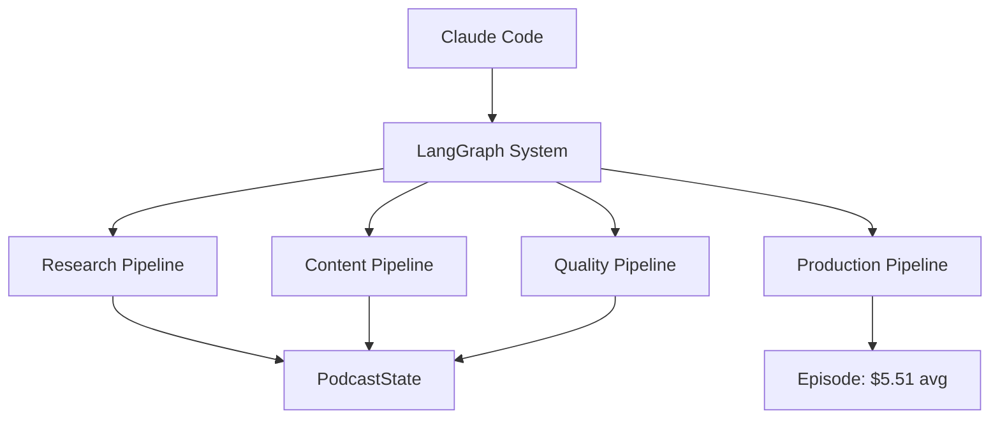

# CLAUDE.md - AI Podcast Production Orchestration Hub 🎙️
<!-- Version: 10.0.0 | Token Budget: 8K | Hierarchical Context System | Updated: 2025-09-04 -->

## 🚨 CRITICAL CONSTRAINTS [IMMUTABLE]

<TEMPORAL_ENFORCEMENT priority="ABSOLUTE">
**DATE: SEPTEMBER 2025** | Training cutoff: Oct 2024 | **ALL technical knowledge OUTDATED**

**MANDATORY**: Validate EVERY technical decision:
- `mcp__perplexity-ask__perplexity_ask` → Technical patterns
- `WebSearch` → Current documentation  
- Query template: `"[TECH] September 2025 best practices current"`

**VIOLATIONS → IMMEDIATE REJECTION**
</TEMPORAL_ENFORCEMENT>

<VOICE_GOVERNANCE override="NEVER">
**VOICE_ID**: ZF6FPAbjXT4488VcRRnw (Amelia) | **NO CHANGES WITHOUT PERMISSION**
Config: `podcast_production/config/production-voice.json`
</VOICE_GOVERNANCE>

## 🎯 SYSTEM ARCHITECTURE



**Core**: LangGraph orchestration | 16 agents | StateGraph workflows | Async patterns
**Status**: Production-ready | 125+ episodes | 95% reliability | <$6 budget

## 📁 HIERARCHICAL CONTEXT LOADING

```yaml
context_hierarchy:
  root: "CLAUDE.md (YOU ARE HERE) - 8K tokens"
  domains:
    production: "@podcast_production/CLAUDE.md - 5K tokens"
    development: "@.claude/CLAUDE.md - 3K tokens" 
    testing: "@tests/CLAUDE.md - 2K tokens"
    docs: "@docs/CLAUDE.md - 1K token"
  
loading_strategy:
  task_production: ["@podcast_production/CLAUDE.md", "@podcast_production/agents/CLAUDE.md"]
  task_development: ["@.claude/CLAUDE.md", "@.claude/agents/dev/CLAUDE.md"]
  task_testing: ["@tests/CLAUDE.md", "@tests/quality_gates/CLAUDE.md"]
  task_research: ["@podcast_production/workflows/CLAUDE.md", "@podcast_production/agents/CLAUDE.md"]
```

**LOAD CONTEXTS BASED ON TASK - DON'T LOAD EVERYTHING**

## ⚡ QUICK COMMANDS

### Production
```bash
# Episode production
cd podcast_production && python main.py --topic "[TOPIC]" --budget 5.51
python main.py --topic "[TOPIC]" --dry-run  # Test first!

# Monitoring
npm run dashboard           # Real-time monitoring
python check_health.py      # System health
python validate_production_readiness.py
```

### Development
```bash
/produce-episode           # Full production from research
/research-optimized        # Research-only workflow
/batch-produce            # Multi-episode production
/cost-check              # Budget analysis
```

### Quality
```bash
pytest tests/ --verbose                      # Full test suite
./tests/quality_gates/test_brand_voice.sh   # Brand validation
./tests/quality_gates/test_dual_evaluation.sh
```

## 🏗️ LANGGRAPH PATTERNS

### State Management
```python
from typing_extensions import TypedDict
from typing import List, Dict, Any

class PodcastState(TypedDict):
    """Immutable state - September 2025 patterns"""
    episode_id: str
    topic: str
    research_data: Dict[str, Any]
    script: str
    audio_url: str
    cost_tracking: Dict[str, float]
    quality_scores: Dict[str, float]
```

### Async Node Pattern
```python
async def agent_node(state: PodcastState) -> PodcastState:
    """Standard async node - September 2025"""
    async with httpx.AsyncClient(timeout=httpx.Timeout(30.0)) as client:
        # Concurrent execution with gather()
        results = await asyncio.gather(*tasks, return_exceptions=True)
    return {...state, "new_field": results}
```

### Workflow Definition
```python
graph = StateGraph(PodcastState)
graph.add_node("research", research_node)
graph.add_edge(START, "research")
graph.add_conditional_edges("research", route_function)
```

## 🤖 AGENT ARCHITECTURE

### Production Agents (16)
| Pipeline | Agents | Purpose | Context |
|----------|--------|---------|---------|
| Research | discovery, deep_dive, validation, synthesis | Knowledge gathering | @podcast_production/agents/CLAUDE.md |
| Content | question_generator, planner, writer, brand_validator | Script creation | @podcast_production/agents/CLAUDE.md |
| Quality | claude_evaluator, gemini_evaluator | Multi-eval consensus | @.claude/agents/CLAUDE.md |
| Production | audio_synthesizer, audio_validator | TTS & validation | @podcast_production/agents/CLAUDE.md |

### Development Agents
| Type | Agents | Auto-Triggers | Context |
|------|--------|---------------|---------|
| Dev | langgraph-builder, state-architect, test-harness | Component creation | @.claude/agents/dev/CLAUDE.md |
| Infra | monitor, deployment, performance, recovery, api | System ops | @.claude/agents/infrastructure/CLAUDE.md |

## 💰 COST & QUALITY METRICS

```yaml
targets:
  cost_per_episode: $5.51 (max: $6.00)
  brand_consistency: >85%
  quality_consensus: >8.0/10
  success_rate: >95%
  
monitoring:
  real_time: npm run dashboard
  cost_tracking: Centralized logging + batch writes
  quality_gates: Multi-evaluator consensus
  recovery: Checkpoint-based with rollback
```

## 🔒 SECURITY & APIS

**Required APIs**: ElevenLabs | Claude | Gemini | Perplexity
**Config**: `.env` (git-ignored) | MCP servers configured
**Validation**: `claude mcp list` → ✓ Connected

## 🚀 NAVIGATION GUIDE

### By Task Type
- **🎙️ Produce Episode**: @podcast_production/CLAUDE.md → workflows → agents
- **🔧 Build Components**: @.claude/CLAUDE.md → agents/dev → langgraph-builder
- **✅ Test System**: @tests/CLAUDE.md → quality_gates → integration
- **📚 Learn System**: @docs/CLAUDE.md → ARCHITECTURE.md → reports

### By Experience Level
- **Beginner**: Start with dry-run → @docs/CLAUDE.md
- **Intermediate**: @podcast_production/workflows/CLAUDE.md
- **Advanced**: @.claude/agents/dev/CLAUDE.md

## 📊 SYSTEM STATUS

| Metric | Status | Target | Current |
|--------|--------|--------|---------|
| Architecture | ✅ Stable | 100% | 100% |
| Agents | ✅ Complete | 16 | 16 |
| Episodes | ✅ Production | ∞ | 125+ |
| Cost | ✅ Optimized | <$6 | $5.51 |
| Quality | ✅ Consistent | >8.0 | 8.5 |

## 🎯 THINKING MODES

```markdown
think        → Basic reasoning (simple tasks)
think hard   → Enhanced analysis (recommended)
ultrathink   → Maximum computation (complex problems)
```

## ⚙️ DOMAIN CONTEXTS

### Production Domain
```markdown
@podcast_production/CLAUDE.md - LangGraph workflows, agent coordination
  ├── @agents/CLAUDE.md - Agent interfaces and patterns
  ├── @workflows/CLAUDE.md - StateGraph definitions
  └── @config/CLAUDE.md - Configuration governance
```

### Development Domain
```markdown
@.claude/CLAUDE.md - Development orchestration hub
  ├── @agents/dev/CLAUDE.md - Component builders
  ├── @agents/infrastructure/CLAUDE.md - System operations
  └── @commands/CLAUDE.md - Slash command registry
```

### Quality Domain
```markdown
@tests/CLAUDE.md - Testing patterns and gates
  ├── @quality_gates/CLAUDE.md - Validation rules
  └── @integration/CLAUDE.md - E2E workflows
```

## 🔄 INHERITANCE PATTERNS

```yaml
inheritance_chain:
  - ~/.claude/CLAUDE.md         # Global user preferences
  - ./CLAUDE.md                 # Project root (this file)
  - ./domain/CLAUDE.md          # Domain-specific
  - ./domain/component/CLAUDE.md # Component-specific

override_rules:
  - Children override parents
  - Explicit > Implicit
  - Local > Global
  - Task-specific > General
```

## 💡 OPTIMIZATION TIPS

1. **Context Loading**: Only load what you need via @references
2. **Token Budget**: Monitor with `/context` command
3. **Clear Often**: Use `/clear` between unrelated tasks
4. **Dry Run First**: Always test with `--dry-run`
5. **Cost Tracking**: Check dashboard for real-time costs

## 🚨 COMMON WORKFLOWS

### New Episode
```bash
# Research → Script → Audio
/research-optimized "Why do we dream?"
/produce-episode  # Uses latest research
```

### System Validation
```bash
python validate_production_readiness.py
python check_health.py
npm run dashboard
```

### Development
```bash
# Build new component
Use langgraph-builder agent to create StateGraph component
Use state-architect agent to optimize state management
Use test-harness agent to validate implementation
```

## 📈 LEARNING PATH

1. **WALK** (Free): Read docs, explore architecture
2. **CRAWL** ($10): Single episode with monitoring
3. **RUN** ($100+): Batch production, optimization

## 🎪 PHILOSOPHY

**Mission**: Learn AI orchestration through podcast production
**Values**: Intellectual humility - embrace what we don't know
**Method**: Every episode teaches transferable AI patterns

---

**Quick Refs**: `/init` | `/clear` | `@context` | `think hard`
**Help**: @docs/troubleshooting | @.claude/GETTING_STARTED.md
**Version**: 10.0.0 | **Architecture**: LangGraph + Hierarchical Context