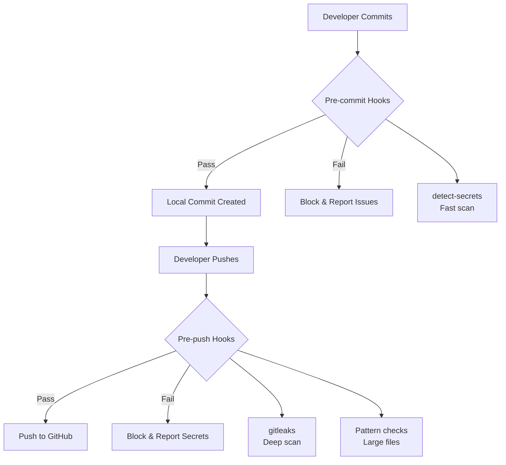

# 🔒 Security Hooks Documentation
<!-- Last Updated: September 2025 | Implementation: Dual-Layer Protection -->

## 📋 Table of Contents
- [Overview](#overview)
- [Architecture](#architecture)
- [Installation](#installation)
- [Usage](#usage)
- [Configuration](#configuration)
- [Tools](#tools)
- [Emergency Procedures](#emergency-procedures)
- [Troubleshooting](#troubleshooting)
- [Best Practices](#best-practices)

## 🎯 Overview

**Purpose**: Prevent secrets and sensitive data from being pushed to GitHub

**Protection Layers**:
1. **Pre-commit**: Fast checks on staged files (detect-secrets)
2. **Pre-push**: Deep scan of all commits (gitleaks)

**Key Features**:
- Zero false-negatives approach
- Custom rules for project-specific API keys
- Large file detection (>50MB)
- Hardcoded pattern detection
- Voice ID governance enforcement

## 🏗️ Architecture



## 📦 Installation

### Quick Install (Recommended)
```bash
# Run the automated setup script
./scripts/setup-hooks.sh

# This will:
# 1. Install required tools (gitleaks, detect-secrets, pre-commit)
# 2. Configure pre-commit hooks
# 3. Install pre-push hooks
# 4. Create secrets baseline
# 5. Run initial security scan
```

### Manual Installation

#### 1. Install Dependencies
```bash
# macOS
brew install gitleaks
pip3 install detect-secrets pre-commit

# Linux
curl -sSfL https://github.com/gitleaks/gitleaks/releases/latest/download/gitleaks-linux-amd64 -o /tmp/gitleaks
chmod +x /tmp/gitleaks
sudo mv /tmp/gitleaks /usr/local/bin/
pip3 install detect-secrets pre-commit

# Windows (WSL recommended)
# Follow Linux instructions above
```

#### 2. Install Hooks
```bash
# Install pre-commit hooks
pre-commit install -c config/.pre-commit-config.yaml

# Install pre-push hook
cp scripts/hooks/pre-push.sh .git/hooks/pre-push
chmod +x .git/hooks/pre-push
```

#### 3. Initialize Baseline
```bash
# Create initial secrets baseline
detect-secrets scan --baseline config/.secrets.baseline
```

## 🔧 Usage

### Normal Workflow
```bash
# Normal development - hooks run automatically
git add .
git commit -m "Feature: Add new functionality"
git push origin main

# Hooks will:
# 1. Pre-commit: Quick scan staged files
# 2. Pre-push: Deep scan all commits
# 3. Block if any issues found
```

### Managing False Positives

#### Update Baseline
```bash
# When adding legitimate patterns that trigger false positives
detect-secrets scan --update config/.secrets.baseline

# Review the changes
git diff config/.secrets.baseline

# Commit the updated baseline
git add config/.secrets.baseline
git commit -m "chore: Update secrets baseline"
```

#### Allowlist Files
Edit `.gitleaks.toml` to exclude specific files:
```toml
[allowlist]
paths = [
    ".env.example",
    "docs/**/*.md",
    "**/test_*.py"
]
```

### Emergency Override
```bash
# ⚠️ ONLY use after manual verification
# When you're 100% sure there are no real secrets
git push --no-verify

# IMPORTANT: Document why override was necessary
echo "Override reason: [explanation]" >> docs/security-overrides.log
git add docs/security-overrides.log
git commit -m "doc: Document security override for [reason]"
```

## ⚙️ Configuration

### Gitleaks Configuration (`.gitleaks.toml`)

```toml
# Project-specific API key patterns
[[rules]]
id = "elevenlabs-api-key"
description = "ElevenLabs API Key"
regex = '''(?i)(elevenlabs[_\-\s]?(api)?[_\-\s]?key|ELEVENLABS_API_KEY)\s*[=:]\s*['"]?([a-zA-Z0-9]{32,})['"]?'''
tags = ["key", "elevenlabs"]

[[rules]]
id = "perplexity-api-key"
description = "Perplexity API Key"
regex = '''(?i)(perplexity[_\-\s]?(api)?[_\-\s]?key|PERPLEXITY_API_KEY)\s*[=:]\s*['"]?(pplx-[a-zA-Z0-9]{48,})['"]?'''
tags = ["key", "perplexity"]

# Add more custom rules as needed
```

### Pre-commit Configuration (`config/.pre-commit-config.yaml`)

```yaml
repos:
  - repo: https://github.com/Yelp/detect-secrets
    rev: v1.5.0
    hooks:
      - id: detect-secrets
        args:
          - --baseline
          - config/.secrets.baseline
        exclude: |
          (?x)^(
            node_modules/|
            dist/|
            build/
          )
```

## 🛠️ Tools

### Gitleaks
- **Purpose**: Deep secret scanning with regex patterns
- **Strengths**: Comprehensive rule set, git history scanning
- **Performance**: Fast native Go implementation
- **Version**: 8.18+ (September 2025)

### detect-secrets
- **Purpose**: Baseline-aware secret detection
- **Strengths**: Low false-positive rate, Python integration
- **Performance**: Good for incremental scanning
- **Version**: 1.5.0+

### Comparison

| Feature | Gitleaks | detect-secrets |
|---------|----------|---------------|
| Speed | ⚡ Very Fast | 🚀 Fast |
| False Positives | Medium | Low |
| Git Integration | Excellent | Good |
| Custom Rules | Yes (TOML) | Yes (Python) |
| Baseline Support | No | Yes |
| Language | Go | Python |

## 🚨 Emergency Procedures

### If Secrets Are Detected

1. **DO NOT FORCE PUSH**
2. **Investigate the detection**:
   ```bash
   # See what gitleaks found
   gitleaks detect --source . --verbose

   # Check detect-secrets findings
   detect-secrets scan
   ```

3. **If real secret found**:
   ```bash
   # Remove from git history (if not pushed)
   git reset --soft HEAD~1

   # Fix the file
   # Remove the secret and use environment variable

   # Re-commit without the secret
   git add .
   git commit -m "fix: Remove accidentally committed secret"
   ```

4. **If already pushed**:
   - **IMMEDIATELY** rotate the exposed credential
   - Use BFG Repo-Cleaner or git-filter-branch to clean history
   - Notify team and security contacts

### Rotation Procedures

#### ElevenLabs API Key
1. Log into ElevenLabs dashboard
2. Navigate to Profile → API Keys
3. Delete compromised key
4. Generate new key
5. Update `.env` file
6. Test with `python test_api.py`

#### Perplexity API Key
1. Visit https://www.perplexity.ai/settings/api
2. Revoke existing key
3. Generate new key
4. Update `.env` file
5. Test with research pipeline

## 🔍 Troubleshooting

### Common Issues

#### "Gitleaks not found"
```bash
# macOS
brew install gitleaks

# Linux
curl -sSfL https://github.com/gitleaks/gitleaks/releases/latest/download/gitleaks-linux-amd64 -o gitleaks
chmod +x gitleaks
sudo mv gitleaks /usr/local/bin/
```

#### "detect-secrets not found"
```bash
pip3 install detect-secrets
# or
python -m pip install detect-secrets
```

#### False Positives
```bash
# Update baseline to mark as allowed
detect-secrets scan --update config/.secrets.baseline

# Or add to .gitleaks.toml allowlist
```

#### Hook Not Running
```bash
# Verify hook is installed
ls -la .git/hooks/pre-push

# Reinstall
cp scripts/hooks/pre-push.sh .git/hooks/pre-push
chmod +x .git/hooks/pre-push
```

### Testing Hooks

```bash
# Test pre-commit hooks
echo "API_KEY=test_key_12345" > test_file.txt
git add test_file.txt
git commit -m "test" # Should fail

# Test pre-push hooks
git push --dry-run # Safe test without actual push
```

## 📚 Best Practices

### Development Practices

1. **Never hardcode secrets**
   ```python
   # ❌ BAD
   api_key = "sk-proj-abc123..."

   # ✅ GOOD
   api_key = os.getenv("OPENAI_API_KEY")
   ```

2. **Use .env.example**
   ```bash
   # .env.example (commit this)
   ELEVENLABS_API_KEY=your-api-key-here

   # .env (never commit)
   ELEVENLABS_API_KEY=actual-secret-key
   ```

3. **Configuration files**
   ```python
   # config/settings.py
   from dotenv import load_dotenv
   load_dotenv()

   ELEVENLABS_API_KEY = os.getenv("ELEVENLABS_API_KEY")
   if not ELEVENLABS_API_KEY:
       raise ValueError("ELEVENLABS_API_KEY not set")
   ```

### Security Hygiene

1. **Regular scanning**
   ```bash
   # Weekly full scan
   gitleaks detect --source . --log-opts="--all"

   # Before major releases
   detect-secrets scan --all-files
   ```

2. **Audit logs**
   ```bash
   # Check for any --no-verify usage
   git log --grep="--no-verify"
   ```

3. **Team training**
   - Share this documentation with all developers
   - Include in onboarding process
   - Regular security reminders

### Voice ID Governance

**Special Rule**: Production voice ID must use centralized configuration
```python
# ❌ NEVER hardcode
voice_id = "ZF6FPAbjXT4488VcRRnw"

# ✅ ALWAYS use function
from config.voice_config import get_production_voice_id
voice_id = get_production_voice_id()
```

## 📊 Metrics

Track security effectiveness:
```bash
# Count prevented incidents
grep "Pre-push checks FAILED" .git/hooks/pre-push.log | wc -l

# Audit override usage
grep "bypass" .git/hooks/pre-push.log

# Baseline updates
git log --oneline config/.secrets.baseline
```

## 🔗 Related Documentation

- [Project Security Policy](../SECURITY.md)
- [Contributing Guidelines](../CONTRIBUTING.md)
- [Development Setup](./SETUP.md)
- [Git Workflow](./GIT_WORKFLOW.md)

## 📈 Updates and Maintenance

**Last Updated**: September 2025
**Tools Versions**:
- gitleaks: 8.18+
- detect-secrets: 1.5.0
- pre-commit: 3.5+

**Review Schedule**:
- Monthly: Update patterns and rules
- Quarterly: Tool version updates
- Annually: Full security audit

---

**Remember**: Security is everyone's responsibility. When in doubt, ask for help rather than bypassing protections.
