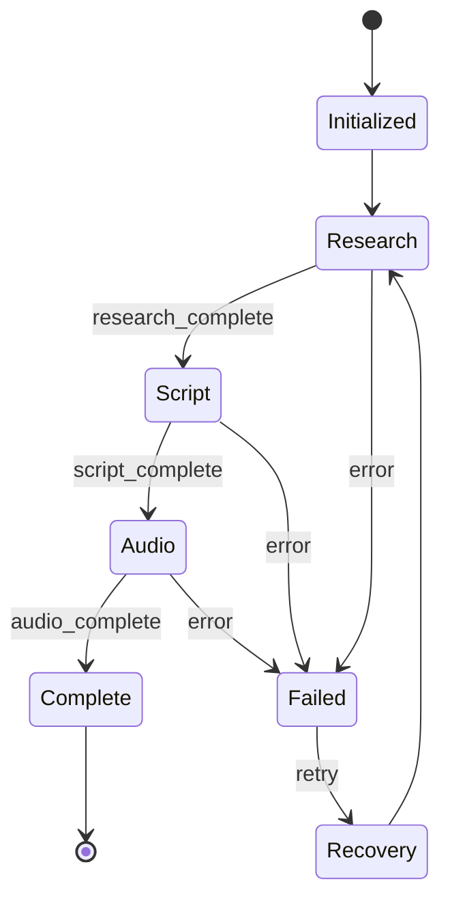

# 📊 Production State Management
<!-- Component Context | Token Budget: 3K | Purpose: State & Session Management -->

## 🎯 STATE MANAGEMENT OVERVIEW

**Purpose:** Persistent state management for episode production lifecycle  
**Core System:** `ProductionStateManager` class  
**State File:** `production/state.json`  
**Session Pattern:** Episode-based with checkpoint recovery

## 🗄️ STATE ARCHITECTURE

### Global State Structure
```json
{
  "version": "3.0.0",
  "active_episodes": {
    "ep_001_20250903_143022": { /* episode state */ },
    "ep_002_20250903_150530": { /* episode state */ }
  },
  "completed_episodes": {
    "ep_001_20250902_093015": { /* archived state */ }
  },
  "total_cost": 127.45,
  "total_episodes": 25,
  "last_updated": "2025-09-03T15:05:30Z",
  "metrics": {
    "avg_cost_per_episode": 5.51,
    "avg_production_time": 22.3,
    "success_rate": 0.94
  }
}
```

### Episode State Structure
```json
{
  "episode_number": 1,
  "topic": "The Dirty Secret: Even Experts Make It Up",
  "session_id": "ep_001_20250903_143022",
  "status": "audio",
  "phases": {
    "research": {
      "status": "complete",
      "cost": 1.05,
      "start_time": "2025-09-03T14:30:22Z",
      "end_time": "2025-09-03T14:37:45Z",
      "checkpoint": "research_complete.json"
    },
    "script": {
      "status": "complete",
      "cost": 0.85,
      "start_time": "2025-09-03T14:38:00Z",
      "end_time": "2025-09-03T14:42:30Z",
      "checkpoint": "script_complete.json"
    },
    "audio": {
      "status": "active",
      "cost": 0.0,
      "start_time": "2025-09-03T14:43:00Z",
      "end_time": null,
      "checkpoint": null
    }
  },
  "total_cost": 1.90,
  "quality_scores": {
    "research_depth": 9.2,
    "brand_consistency": 0.92,
    "technical_accuracy": 0.88,
    "consensus_score": 0.87
  },
  "created_at": "2025-09-03T14:30:22Z",
  "updated_at": "2025-09-03T14:43:00Z"
}
```

## 🔧 STATE MANAGER API

### Core Operations
```python
from nobody_knows.production.state_manager import ProductionStateManager

# Initialize manager
state_mgr = ProductionStateManager()

# Create episode session
session_id = state_mgr.create_episode_session(
    episode_num=1,
    topic="Your Topic Here"
)

# Update phase status
state_mgr.update_phase(
    session_id=session_id,
    phase="research",
    status="complete",
    cost=1.05
)

# Save checkpoint
state_mgr.save_checkpoint(
    session_id=session_id,
    phase="script",
    data={"script": "...", "metrics": {...}}
)

# Complete episode
state_mgr.complete_episode(session_id)
```

### Query Operations
```python
# Get active episodes
active = state_mgr.get_active_episodes()

# Get episode state
state = state_mgr.get_episode_state(session_id)

# Get phase status
status = state_mgr.get_phase_status(session_id, "research")

# Get total metrics
metrics = state_mgr.get_global_metrics()
```

### Recovery Operations
```python
# Resume from checkpoint
state_mgr.resume_episode(session_id)

# Load checkpoint data
checkpoint = state_mgr.load_checkpoint(session_id, "script")

# Recover failed session
state_mgr.recover_failed_session(session_id)

# Clean orphaned sessions
state_mgr.cleanup_orphaned_sessions(older_than_hours=24)
```

## 📁 SESSION DIRECTORY STRUCTURE

### Active Session Layout
```
production/ep_001_20250903_143022/
├── session.json           # Session metadata
├── research/
│   ├── research_findings.json
│   ├── validation_report.json
│   ├── synthesis_package.json
│   └── checkpoint.json
├── script/
│   ├── initial_script.md
│   ├── polished_script.md
│   ├── quality_report.json
│   └── checkpoint.json
└── audio/
    ├── audio_chunks/      # If chunking needed
    ├── synthesis_report.json
    ├── validation_results.json
    └── checkpoint.json
```

### Checkpoint Contents
```json
{
  "phase": "script",
  "timestamp": "2025-09-03T14:42:30Z",
  "data": {
    "script_content": "...",
    "word_count": 4215,
    "estimated_duration": 27.5,
    "quality_scores": {...}
  },
  "next_phase": "audio",
  "can_resume": true
}
```

## 🔄 STATE TRANSITIONS

### Phase Progression


### Status Values
```yaml
episode_status:
  - initialized  # Session created
  - research     # Research phase active
  - script       # Script phase active
  - audio        # Audio phase active
  - complete     # Episode finished
  - failed       # Production failed
  - archived     # Moved to completed

phase_status:
  - pending      # Not started
  - active       # Currently processing
  - complete     # Successfully finished
  - failed       # Error occurred
  - skipped      # Bypassed (testing)
```

## 💰 COST TRACKING

### Cost Attribution
```python
# Track per-operation cost
state_mgr.add_cost(
    session_id=session_id,
    phase="research",
    operation="perplexity_query",
    cost=0.15
)

# Get phase costs
research_cost = state_mgr.get_phase_cost(session_id, "research")

# Get episode total
total_cost = state_mgr.get_episode_cost(session_id)

# Get global spending
global_cost = state_mgr.get_total_spending()
```

### Cost Limits
```yaml
phase_budgets:
  research: 2.00
  script: 2.00
  audio: 3.00
  total: 7.00

alerts:
  phase_overage: "Warn at 80% of budget"
  episode_overage: "Stop at 100% of total"
  global_limit: "Daily cap at $50"
```

## 🛡️ ERROR RECOVERY

### Checkpoint Recovery
```python
# Automatic checkpoint on phase completion
state_mgr.checkpoint_phase(session_id, "research")

# Manual checkpoint
state_mgr.create_checkpoint(
    session_id=session_id,
    checkpoint_name="custom_checkpoint",
    data={...}
)

# Restore from checkpoint
state_mgr.restore_checkpoint(
    session_id=session_id,
    checkpoint_name="research_complete"
)
```

### Failure Handling
```python
try:
    # Production operation
    result = produce_episode(session_id)
except Exception as e:
    # Mark phase as failed
    state_mgr.mark_phase_failed(
        session_id=session_id,
        phase="audio",
        error=str(e)
    )
    
    # Attempt recovery
    if state_mgr.can_recover(session_id):
        state_mgr.initiate_recovery(session_id)
    else:
        state_mgr.archive_failed_episode(session_id)
```

## 📊 METRICS & REPORTING

### Performance Metrics
```python
# Get production metrics
metrics = state_mgr.get_production_metrics()
# Returns:
{
  "total_episodes": 25,
  "success_rate": 0.94,
  "avg_production_time": 22.3,
  "avg_cost": 5.51,
  "phase_performance": {
    "research": {"avg_time": 7.2, "success_rate": 0.95},
    "script": {"avg_time": 5.1, "success_rate": 0.92},
    "audio": {"avg_time": 10.0, "success_rate": 0.98}
  }
}
```

### Quality Metrics
```python
# Get quality trends
quality = state_mgr.get_quality_metrics()
# Returns:
{
  "avg_brand_consistency": 0.91,
  "avg_technical_accuracy": 0.87,
  "avg_engagement_score": 0.83,
  "avg_audio_quality": 0.89,
  "trending": "improving"
}
```

## 🔧 CLI OPERATIONS

### Command Line Interface
```bash
# List active episodes
python state_manager.py --list

# Resume specific episode
python state_manager.py --resume ep_001

# Clean failed sessions
python state_manager.py --cleanup

# Export metrics
python state_manager.py --export-metrics

# Reset state (danger!)
python state_manager.py --reset --confirm
```

## 🔗 INTEGRATION POINTS

### With Commands
- Commands create sessions via state manager
- State persists across command execution
- Checkpoint recovery enables workflow resumption

### With Agents
- Agents report progress to state manager
- Cost tracking per agent operation
- Quality metrics from agent outputs

### With Hooks
- Pre-operation state validation
- Post-operation state updates
- Error recovery triggers

---

*State Management Context v1.0 | Token Usage: ~2.9K*  
*Core system for production state and session lifecycle*